# Repo Truth Audit

[简体中文](README.zh-CN.md)

Formally: **Repository Operational Truth Audit**

A standalone, evidence-led Codex Skill for recovering what a long-evolved
repository actually operates through **today** and, when explicitly asked,
carrying a bounded structural change through implementation and verification.

Current source candidate: `0.2.0`
Latest public release: `v0.1.0`

Skill invocation slug: `repository-operational-truth-audit` (unchanged).

This is not a generic repository score, public-launch checklist, or universal
automatic fixer. It follows decision-bearing entrypoints, selectors, authority
owners, durable state, derived artifacts, installed identities, evidence gates,
and explicit external boundaries. Audit remains read-only by default. Plan
stops before edits. An explicit Operate request can continue through protected
witnesses, coherent increments, recovery-aware checkpoints, retirement of
superseded paths, and acceptance at the requested source/delivery layer.

## What problem it solves

Ordinary code review begins with a bounded change. Ordinary verification begins
with a named claim. Repository Operational Truth Audit is for the moments when
neither starting point is sufficient:

- Which path is actually live after months away from this repository?
- Before a migration or safe archive, which source, state, package, and
  installed identities still matter?
- Do source, generated artifacts, distribution packages, installed copies,
  documentation, and tests describe the same operational path?
- What layer does a green test or receipt actually prove—and could the claimed
  contract be broken while that evidence stays green?
- Are two modes intentionally selected and isolated, or is one an unowned
  shadow path?
- If a restore or release claim depends on an unavailable remote schema,
  secret, dashboard setting, device, or human step, how far can the current
  decision honestly go?
- Which structural boundary should change first when formatting, persistence,
  selection, and delivery have become inseparable?
- Did a refactor preserve behavior while actually moving ownership and the
  selected artifact, or did it only add a facade?
- After the change, is the next small feature materially easier to add without
  crossing the old owners?

## What a result looks like

**Not ready**

> Source tests pass, but `distribution.json` still selects a stale artifact.

**Ready within repository scope**

> Stable and development paths have explicit selectors, isolated identities,
> and no cross-boundary caller.

**Verified checkpoint, whole goal still open**

> Formatting is isolated and behavior is protected, but the manifest still
> selects the legacy writer; this increment is safe to retain, not complete.

**Complete at the agreed source + artifact layers**

> The shipping selector uses the new owners, the old writer is unreachable and
> retired, behavior/state witnesses pass, and the declared artifact matches.

## Architecture: what this diagram serves

The diagram answers one public-reader question:

> How does Repo Truth Audit turn an exact repository snapshot and a concrete
> owner intent into a bounded read-only answer, a decision-ready plan, or an
> authorized structural change with verified completion without overclaiming
> evidence or external state?

It depicts the **Audit / Plan / Operate runtime contract**. Packaging,
installation, and release of this Skill remain a separate reader job.

Solid arrows are in-scope evidence or implementation flow. Dotted arrows are
conditional authority/external-observation paths. Thick return arrows reopen
diagnosis or the next increment when evidence changes.

```mermaid
flowchart TB
  subgraph R00_PIN["01 · Pin intent + repository"]
    N00_OWNER_DECISION["Owner intent + terminal boundary<br/>Audit · Plan · Operate"]
    N01_START_PIN["Exact start pin<br/>physical/Git root · branch · HEAD · working tree"]
    N02_READ_ONLY["Read-only diagnosis contract<br/>Audit + Plan never edit · Operate has a separate gate"]
  end

  subgraph R10_RESOLVE["02 · Resolve authority + reachability"]
    N10_AUTHORITY["Current authority owners<br/>source · config · durable state · runbooks · history"]
    N11_LIVE_SELECTORS["Live entrypoints + selectors<br/>registrations · callers · pipelines · services · operator routes"]
    N12_OWNERSHIP_STATE["Ownership + state isolation<br/>selector · owner · callers · state · version · retirement intent"]
  end

  subgraph R20_TRAVERSE["03 · Traverse evidence layers"]
    N20_SOURCE_STATE["Source · config · durable state<br/>the layer that owns behavior or persistent truth"]
    N21_DERIVED_ARTIFACT["Generated · built · packaged · projected<br/>derivation identity and source-to-artifact relation"]
    N22_INSTALLED_IDENTITY["Installed · deployed identity<br/>an exact instance only when freshly observed"]
    N23_EVIDENCE_GATES["Evidence gates<br/>exact input · path · assertion · proof layer · observed identity"]
  end

  subgraph R30_CHALLENGE["04 · Challenge + adjudicate"]
    N30_TRACE["Decision-bearing candidate trace<br/>claim → mechanism/state → gap → impact → fresh validation"]
    N31_FALSE_GREEN["False-green challenge<br/>did the exact path run, observe the assertion, and fail when broken?"]
    N32_MULTIPLICITY["Multiplicity or shadow path?<br/>selection · ownership · isolation · callers · retirement intent"]
    N33_EXTERNAL_UNKNOWN["Decision-critical external unknown<br/>missing observation → prevented claim → affected decision → needed proof"]
    N34_SPECIALIST["Specialist adapter<br/>bounded material observation only; no default fan-out"]
  end

  subgraph R40_DECIDE["05 · Audit / Plan exits"]
    N40_OUTCOMES["Adjudication register<br/>contradiction · false green · shadow path · intentional multiplicity<br/>residue · unknown · external boundary · clean within scope"]
    N41_STOPPING{"Decision fixed-point test<br/>every candidate adjudicated · no new material evidence edge"}
    N42_DECISION_OUTPUT["Audit answer + proof boundary<br/>pin · live topology · traces · non-findings · verification · overhead"]
    N44_PLAN_CONTRACT["Plan contract · no mutation<br/>finite end state · sequence · witnesses · recovery · acceptance"]
    N43_END_REPIN["End re-pin + mutation statement<br/>mode · status · proof layer · ending identity"]
  end

  subgraph R60_OPERATE["06 · Authorize + operate"]
    N60_AGREED_OUTCOME["Finite agreed outcome<br/>change pressure · end state · applicable B/S/D/U obligations"]
    N61_IMPLEMENTATION_GATE["Explicit implementation gate<br/>action intent · target · finite outcome · effect authority"]
    N62_PROTECTED_WITNESSES["Protected behavior + structure witnesses<br/>selected entry · failures · state effects · falsifier"]
    N63_COHERENT_INCREMENT["Coherent increment<br/>reconcile inputs · implement · inspect diff · preserve owner work"]
    N64_VERIFY_CHALLENGE["Verify + challenge current source<br/>behavior · structure · delivery · strongest counterexample"]
    N65_CHECKPOINT["Verified checkpoint<br/>safe increment retained · original goal + remaining obligations stay visible"]
    N66_RECOVERY["Reconcile before resume<br/>absent · complete · partial · concurrent · unobservable effects"]
    N67_WHOLE_GOAL["Whole-goal B/S/D/U acceptance<br/>every applicable obligation proven at the requested layer"]
    N68_OPERATION_OUTPUT["Complete · checkpoint · blocked · recovered<br/>changes · effects · evidence · unknowns · final identity"]
  end

  subgraph R50_EXTERNAL["External proof boundary"]
    N50_OBSERVATION_GATE["Fresh observation gate<br/>exact scope + authorization + named current instance"]
    N51_EXTERNAL_STATE["Runtime · edge · device · account · owner acceptance<br/>explicitly unknown until freshly observed"]
  end

  %% E01_DECISION_BOUNDS_PIN
  N00_OWNER_DECISION -->|bounds| N01_START_PIN
  %% E02_PIN_BINDS_READ_ONLY
  N01_START_PIN -->|bind scope| N02_READ_ONLY
  %% E03_PIN_TO_AUTHORITY
  N02_READ_ONLY -->|observe| N10_AUTHORITY
  %% E04_AUTHORITY_TO_SELECTORS
  N10_AUTHORITY -->|resolve reachability| N11_LIVE_SELECTORS
  %% E05_SELECTORS_TO_OWNERSHIP
  N11_LIVE_SELECTORS -->|identify selection| N12_OWNERSHIP_STATE
  %% E06_OWNERSHIP_TO_SOURCE
  N12_OWNERSHIP_STATE -->|reach owner| N20_SOURCE_STATE
  %% E07_SOURCE_TO_ARTIFACT
  N20_SOURCE_STATE -->|derive| N21_DERIVED_ARTIFACT
  %% E08_ARTIFACT_TO_INSTALL
  N21_DERIVED_ARTIFACT -->|identify instance| N22_INSTALLED_IDENTITY
  %% E09_SOURCE_TO_GATES
  N20_SOURCE_STATE -->|prove layer| N23_EVIDENCE_GATES
  %% E10_ARTIFACT_TO_GATES
  N21_DERIVED_ARTIFACT -->|prove identity| N23_EVIDENCE_GATES
  %% E11_INSTALL_TO_GATES
  N22_INSTALLED_IDENTITY -->|prove exact instance| N23_EVIDENCE_GATES
  %% E12_AUTHORITY_TO_TRACE
  N10_AUTHORITY -->|claim surface| N30_TRACE
  %% E13_SELECTION_TO_TRACE
  N12_OWNERSHIP_STATE -->|mechanism + state| N30_TRACE
  %% E14_GATES_TO_TRACE
  N23_EVIDENCE_GATES -->|fresh validation| N30_TRACE
  %% E15_TRACE_TO_FALSE_GREEN
  N30_TRACE -->|challenge proof| N31_FALSE_GREEN
  %% E16_TRACE_TO_MULTIPLICITY
  N30_TRACE -->|adjudicate paths| N32_MULTIPLICITY
  %% E17_TRACE_TO_UNKNOWN
  N30_TRACE -->|name missing proof| N33_EXTERNAL_UNKNOWN
  %% E18_TRACE_TO_SPECIALIST
  N30_TRACE -. only if material .-> N34_SPECIALIST
  %% E19_SPECIALIST_TO_TRACE
  N34_SPECIALIST -. bounded observation .-> N30_TRACE
  %% E20_UNKNOWN_TO_GATE
  N33_EXTERNAL_UNKNOWN -. scope + authorize .-> N50_OBSERVATION_GATE
  %% E21_GATE_TO_EXTERNAL
  N50_OBSERVATION_GATE -. fresh named observation .-> N51_EXTERNAL_STATE
  %% E22_EXTERNAL_TO_TRACE
  N51_EXTERNAL_STATE -. observed evidence only .-> N30_TRACE
  %% E23_TRACE_TO_OUTCOMES
  N30_TRACE -->|adjudicate| N40_OUTCOMES
  %% E24_FALSE_GREEN_TO_OUTCOMES
  N31_FALSE_GREEN -->|record proof result| N40_OUTCOMES
  %% E25_MULTIPLICITY_TO_OUTCOMES
  N32_MULTIPLICITY -->|record path judgment| N40_OUTCOMES
  %% E26_UNKNOWN_TO_OUTCOMES
  N33_EXTERNAL_UNKNOWN -->|retain explicit unknown| N40_OUTCOMES
  %% E27_OUTCOMES_TO_STOP
  N40_OUTCOMES -->|test completeness| N41_STOPPING
  %% E28_STOP_FEEDBACK
  N41_STOPPING == new material evidence edge ==> N10_AUTHORITY
  %% E29_STOP_TO_OUTPUT
  N41_STOPPING -->|fixed point reached| N42_DECISION_OUTPUT
  %% E30_OUTPUT_TO_REPIN
  N42_DECISION_OUTPUT -->|close receipt| N43_END_REPIN
  %% E31_STOP_TO_PLAN
  N41_STOPPING -->|Plan requested| N44_PLAN_CONTRACT
  %% E32_PLAN_TO_REPIN
  N44_PLAN_CONTRACT -->|close without mutation| N43_END_REPIN
  %% E33_STOP_TO_OUTCOME
  N41_STOPPING -. explicit Operate request .-> N60_AGREED_OUTCOME
  %% E34_OUTCOME_TO_GATE
  N60_AGREED_OUTCOME -. match effect authority .-> N61_IMPLEMENTATION_GATE
  %% E35_GATE_TO_WITNESSES
  N61_IMPLEMENTATION_GATE -->|authority confirmed| N62_PROTECTED_WITNESSES
  %% E36_WITNESSES_TO_INCREMENT
  N62_PROTECTED_WITNESSES -->|protect + implement| N63_COHERENT_INCREMENT
  %% E37_INCREMENT_TO_VERIFY
  N63_COHERENT_INCREMENT -->|inspect diff + effects| N64_VERIFY_CHALLENGE
  %% E38_VERIFY_TO_CHECKPOINT
  N64_VERIFY_CHALLENGE -->|current evidence| N65_CHECKPOINT
  %% E39_CHECKPOINT_FEEDBACK
  N65_CHECKPOINT == remaining obligations ==> N60_AGREED_OUTCOME
  %% E40_CHECKPOINT_TO_GOAL
  N65_CHECKPOINT -->|all increments ready| N67_WHOLE_GOAL
  %% E41_CHECKPOINT_TO_RECOVERY
  N65_CHECKPOINT -. interrupted or drifted .-> N66_RECOVERY
  %% E42_RECOVERY_FEEDBACK
  N66_RECOVERY == reconcile + resume ==> N60_AGREED_OUTCOME
  %% E43_GOAL_TO_OUTPUT
  N67_WHOLE_GOAL -->|applicable obligations pass| N68_OPERATION_OUTPUT
  %% E44_OPERATION_TO_REPIN
  N68_OPERATION_OUTPUT -->|close at proven layer| N43_END_REPIN
  %% E45_GOAL_TO_EXTERNAL
  N67_WHOLE_GOAL -. external layer included .-> N50_OBSERVATION_GATE
  %% E46_EXTERNAL_TO_GOAL
  N51_EXTERNAL_STATE -. observed completion evidence .-> N67_WHOLE_GOAL
```



The renderer-neutral model, stable semantic IDs, evidence mapping, and paired
Mermaid source contract live in
[`docs/architecture/`](docs/architecture/README.md).

## When to use it

Use this Skill when a concrete decision depends on reconstructing current
repository topology, especially for:

- long-idle repository re-entry;
- migration, machine move, consolidation, or archival readiness;
- source / generated artifact / package / installed-copy reconciliation;
- authority drift across current product docs, durable agent instructions,
  runbooks, status surfaces, or receipts;
- false-green gates whose assertions may not cover their claimed contract;
- ambiguous stable/development, legacy/current, local/remote, or
  source/deployment paths; or
- a repository claim whose decisive external state is currently unobserved;
- planning a bounded extraction, consolidation, replacement, or retirement
  where live ownership and delivery paths are unclear; or
- implementing that structural outcome when the user explicitly requests edits
  and verification rather than an audit handoff.

## When not to use it

Use a narrower owner for:

- reviewing a diff, commit, branch, or pull request;
- verifying one already-defined claim;
- repairing an isolated known bug with no repository-topology question;
- a dedicated license, security, compliance, or dependency audit;
- generic repository hygiene or documentation cleanup; or
- inspecting or changing a live host, account, database, browser, deployment,
  or owner-controlled surface without a repository-state decision and explicit
  authorization.

An Audit request is read-only by default, and Plan does not edit the target.
Operate requires an explicit implementation request and remains limited to its
actual authority. Local source authorization does not imply public API removal,
durable-data mutation, install, deployment, push, account action, or release.

## Install from the public release

Use the system Skill installer and pin the release tag:

```bash
python3 "${CODEX_HOME:-$HOME/.codex}/skills/.system/skill-installer/scripts/install-skill-from-github.py" \
  --repo IndelibleVivi/repo-truth-audit \
  --path skills/repository-operational-truth-audit \
  --ref v0.1.0
```

Installation creates a derived local copy. The canonical source remains this
repository. A successful install proves installed bytes only; Codex discovery
in a later turn is a separate observable boundary.

The `v0.1.0` tag is immutable and retains its release-era full display name.
Current `main` carries the unreleased `0.2.0` Audit / Plan / Operate source
candidate. Installing `v0.1.0` does not install those candidate capabilities.
The Skill slug remains unchanged.

## Validate or install from a source checkout

```bash
git clone https://github.com/IndelibleVivi/repo-truth-audit.git
cd repo-truth-audit

python3 scripts/validate_architecture.py
python3 scripts/validate_repository.py
python3 -m unittest discover -s tests -p 'test_*.py'
python3 scripts/selftest.py
python3 evals/operation-lab/run_operation_lab.py
python3 scripts/install_skill.py
```

Tracked text files are pinned to LF by `.gitattributes`, so an ordinary Windows
checkout preserves the exact license hashes used by repository validation.
Skill digests sort entries by normalized POSIX relative path, which keeps
source/install receipts comparable across Windows, macOS, and Linux. The
fixture self-test still requires Bash; this does not make every operator
command shell-native on Windows.

The local installer refuses to overwrite a conflicting target. Use
`--replace` only for an intentional upgrade; the replaced copy is preserved in
a recoverable backup and the installer writes a provenance receipt.

## Invoke it

Audit (read-only):

```text
Use $repository-operational-truth-audit to reconstruct this repository's
current operational truth before I resume work. Focus on which entrypoints and
artifacts are live, what the current tests actually prove, and which unknowns
can change the re-entry decision. Keep it read-only.
```

Plan (no target edits):

```text
Use $repository-operational-truth-audit to plan how to separate formatting from
durable writes. Trace the live CLI and distribution selector, preserve current
behavior, define structural and delivery acceptance, and stop before editing.
```

Operate (explicit implementation authority):

```text
Use $repository-operational-truth-audit to separate formatting from durable
writes, keep the current CLI/config compatible, switch the real distribution,
retire the superseded writer, and verify behavior, structure, delivery, and the
next formatter-only extension. Implement the local source change.
```

A complete engagement binds:

```text
one owner decision + one exact repository snapshot
  -> current authority and live selectors
  -> source / configuration / durable state
  -> generated / built / packaged / projected artifacts
  -> installed or deployed identity, only when freshly observed
  -> challenge, adjudication, and explicit external unknowns
  -> Audit answer, Plan boundary, or explicit Operate authority
  -> protected behavior + structural witnesses
  -> coherent increments + checkpoint/recovery loop
  -> behavior / structure / delivery / usefulness acceptance
  -> bounded result + proof limits + end re-pin
```

Tests, receipts, status documents, and successful commands are evidence
surfaces. They prove only the exact input, identity, assertion, and proof layer
they actually observed.

## Output semantics

A material finding closes this trace:

```text
claim or live surface
  -> mechanism or state
  -> contradiction or evidence gap
  -> concrete decision impact
  -> fresh validation
```

The adjudication vocabulary distinguishes:

- validated contradiction;
- false-green evidence;
- shadow path;
- intentional multiplicity;
- non-material residue;
- decision-critical unknown;
- external/environment/policy boundary; and
- clean within the explicit audit object.

These are decision meanings, not a score or a required report template. A clean
result does not claim that the repository has no defects; it means no material
contradiction or decision-critical unknown remained inside the pinned object.

Operate keeps a checkpoint distinct from whole-goal completion and reconciles
the applicable obligations:

- **behavior:** outputs, failures, compatibility, and state effects;
- **structure:** ownership/dependency change and real retirement, not a facade;
- **delivery:** requested manifests, packages, installation, or runtime selectors;
- **usefulness:** the concrete change pressure is reduced, demonstrated with a
  small follow-on change when practical.

Its terminal status is complete, checkpoint, blocked, or aborted/recovered.
Passing tests, worker completion, a byte match, or a state JSON field cannot by
itself upgrade one status to another.

## Repository map

| Path | Authority |
| --- | --- |
| `skills/repository-operational-truth-audit/` | Canonical Skill router, progressive Audit/Operate/Recovery references, optional cited-byte helper, and UI metadata |
| `docs/product-spec.md` | Complete accepted product and acceptance contract |
| `docs/evidence-model.md` | Proof, finding, checkpoint/completion, recovery, and stopping semantics |
| `docs/architecture/` | Renderer-neutral architecture model and the paired English/Chinese README Mermaid contract |
| `docs/forward-behavior-receipt.md` | Historical public-safe `v0.1.0` Audit-only forward evidence |
| `docs/forward-0.2.0-receipt.md` | Public-safe `0.2.0` Audit regression and two-increment Operate evidence |
| `docs/research-basis.md` | Public-safe research provenance and source decisions |
| `docs/current-state.md` | Volatile source, Git, install, CI, and publication truth |
| `evals/cases/` | Controlled read-only behavior cases with evaluator-only expected artifacts |
| `evals/operation-lab/` | Deterministic known-patch rehearsal and anti-false-completion controls; not model evidence |
| `scripts/` | Architecture/repository validation, fixture self-test, and transactional install |
| `tests/` | Repository, architecture, evidence-helper, operation-lab, fixture, and installer regressions |

Chinese editions use the `.zh-CN.md` suffix and preserve the same document
boundaries rather than combining two languages in one file.

## Validation boundaries

Ordinary validation and the controlled operation lab perform no target-model
invocation and no network, browser, account, deployment, or live-system
mutation. The lab applies evaluator-authored known edits to a synthetic subject;
it does not establish autonomous model performance. The CI workflow runs on
macOS and Ubuntu with Python 3.10 and 3.13.

Skill Field Lab may evaluate the controlled cases in disposable workspaces, but
it is optional evaluation infrastructure—not a runtime dependency and not an
owner of this Skill.

## Licensing

This repository is **source-available, not OSI open source**.

- Functional materials—including the Skill, scripts, tests, CI, evals, and
  functional repository contracts—are licensed under the
  [Sustainable Use License 1.0](LICENSE). It permits personal,
  noncommercial, and internal business use; distribution or provision to
  others must remain free of charge and noncommercial under the full terms.
- The standalone README files, changelogs, public documentation, and independent
  diagrams under `docs/` are licensed under
  [CC BY-NC-SA 4.0](LICENSE-DOCUMENTATION.md).
- The exact path map and exceptions are authoritative in
  [`LICENSING.md`](LICENSING.md). Third-party material, if later incorporated,
  remains under its own terms.

Public visibility does not erase those conditions. No external Skill text or
source code is vendored here; conceptual research provenance is documented in
[`docs/research-basis.md`](docs/research-basis.md).
