# Repository Operational Truth Audit

[简体中文](README.zh-CN.md)

A standalone, read-only-first Codex Skill for reconstructing what a
long-evolved repository actually operates through **today** before an owner
makes a re-entry, migration, consolidation, safe-archive, handoff, or
release-readiness decision.

Current release: `v0.1.0`

This is not a generic repository score or a public-launch checklist. It follows
decision-bearing entrypoints, selectors, authority owners, durable state,
derived artifacts, installed identities, evidence gates, and explicit external
proof boundaries. It returns validated contradictions, intentional
multiplicity, non-material residue, decision-critical unknowns, or a concise
clean-within-scope result—and then stops.

## What problem it solves

Ordinary code review begins with a bounded change. Ordinary verification begins
with a named claim. Repository Operational Truth Audit is for the moments when
neither starting point is sufficient:

- Which path is actually live after months away from this repository?
- Before a migration or safe archive, which source, state, package, and
  installed identities still matter?
- Do source, generated artifacts, distribution packages, installed copies,
  documentation, and tests describe the same operational path?
- What layer does a green test or receipt actually prove—and could the claimed
  contract be broken while that evidence stays green?
- Are two modes intentionally selected and isolated, or is one an unowned
  shadow path?
- If a restore or release claim depends on an unavailable remote schema,
  secret, dashboard setting, device, or human step, how far can the current
  decision honestly go?

## Architecture: what this diagram serves

The diagram answers one public-reader question:

> How does one read-only audit turn a concrete owner decision and an exact
> repository snapshot into a decision-bounded answer without crossing
> unobserved external boundaries?

It depicts the **audit runtime contract**. Packaging, installation, and release
of this Skill are deliberately excluded as a separate reader job.

Solid arrows are in-scope evidence traversal. Dotted arrows are conditional
specialist or explicitly authorized external observation. The thick return
arrow means that new decision-relevant evidence reopens the audit.

```mermaid
flowchart TB
  subgraph R00_PIN["01 · Pin the audit object"]
    N00_OWNER_DECISION["Owner decision<br/>re-entry · migration · archive · handoff · release readiness"]
    N01_START_PIN["Exact start pin<br/>physical/Git root · branch · HEAD · working tree"]
    N02_READ_ONLY["Read-only contract<br/>observe without fixing, committing, installing, or deploying"]
  end

  subgraph R10_RESOLVE["02 · Resolve authority + reachability"]
    N10_AUTHORITY["Current authority owners<br/>source · config · durable state · runbooks · history"]
    N11_LIVE_SELECTORS["Live entrypoints + selectors<br/>registrations · callers · pipelines · services · operator routes"]
    N12_OWNERSHIP_STATE["Ownership + state isolation<br/>selector · owner · callers · state · version · retirement intent"]
  end

  subgraph R20_TRAVERSE["03 · Traverse evidence layers"]
    N20_SOURCE_STATE["Source · config · durable state<br/>the layer that owns behavior or persistent truth"]
    N21_DERIVED_ARTIFACT["Generated · built · packaged · projected<br/>derivation identity and source-to-artifact relation"]
    N22_INSTALLED_IDENTITY["Installed · deployed identity<br/>an exact instance only when freshly observed"]
    N23_EVIDENCE_GATES["Evidence gates<br/>exact input · path · assertion · proof layer · observed identity"]
  end

  subgraph R30_CHALLENGE["04 · Challenge + adjudicate"]
    N30_TRACE["Decision-bearing candidate trace<br/>claim → mechanism/state → gap → impact → fresh validation"]
    N31_FALSE_GREEN["False-green challenge<br/>did the exact path run, observe the assertion, and fail when broken?"]
    N32_MULTIPLICITY["Multiplicity or shadow path?<br/>selection · ownership · isolation · callers · retirement intent"]
    N33_EXTERNAL_UNKNOWN["Decision-critical external unknown<br/>missing observation → prevented claim → affected decision → needed proof"]
    N34_SPECIALIST["Specialist adapter<br/>bounded material observation only; no default fan-out"]
  end

  subgraph R40_DECIDE["05 · Decide + stop"]
    N40_OUTCOMES["Adjudication register<br/>contradiction · false green · shadow path · intentional multiplicity<br/>residue · unknown · external boundary · clean within scope"]
    N41_STOPPING{"Decision fixed-point test<br/>every candidate adjudicated · no new material evidence edge"}
    N42_DECISION_OUTPUT["Decision answer + proof boundary<br/>pin · live topology · traces · non-findings · verification · overhead"]
    N43_END_REPIN["End re-pin + mutation statement<br/>reconcile ending identity with the start pin"]
  end

  subgraph R50_EXTERNAL["External proof boundary"]
    N50_OBSERVATION_GATE["Fresh observation gate<br/>exact scope + authorization + named current instance"]
    N51_EXTERNAL_STATE["Runtime · edge · device · account · owner acceptance<br/>explicitly unknown until freshly observed"]
  end

  %% Layout-only constraints: narrow the challenge fan-out at README width.
  N31_FALSE_GREEN ~~~ N32_MULTIPLICITY
  N32_MULTIPLICITY ~~~ N33_EXTERNAL_UNKNOWN
  N33_EXTERNAL_UNKNOWN ~~~ N34_SPECIALIST

  %% E01_DECISION_BOUNDS_PIN
  N00_OWNER_DECISION -->|bounds| N01_START_PIN
  %% E02_PIN_BINDS_READ_ONLY
  N01_START_PIN -->|bind scope| N02_READ_ONLY
  %% E03_PIN_TO_AUTHORITY
  N02_READ_ONLY -->|observe| N10_AUTHORITY
  %% E04_AUTHORITY_TO_SELECTORS
  N10_AUTHORITY -->|resolve reachability| N11_LIVE_SELECTORS
  %% E05_SELECTORS_TO_OWNERSHIP
  N11_LIVE_SELECTORS -->|identify selection| N12_OWNERSHIP_STATE
  %% E06_OWNERSHIP_TO_SOURCE
  N12_OWNERSHIP_STATE -->|reach owner| N20_SOURCE_STATE
  %% E07_SOURCE_TO_ARTIFACT
  N20_SOURCE_STATE -->|derive| N21_DERIVED_ARTIFACT
  %% E08_ARTIFACT_TO_INSTALL
  N21_DERIVED_ARTIFACT -->|identify instance| N22_INSTALLED_IDENTITY
  %% E09_SOURCE_TO_GATES
  N20_SOURCE_STATE -->|prove layer| N23_EVIDENCE_GATES
  %% E10_ARTIFACT_TO_GATES
  N21_DERIVED_ARTIFACT -->|prove identity| N23_EVIDENCE_GATES
  %% E11_INSTALL_TO_GATES
  N22_INSTALLED_IDENTITY -->|prove exact instance| N23_EVIDENCE_GATES
  %% E12_AUTHORITY_TO_TRACE
  N10_AUTHORITY -->|claim surface| N30_TRACE
  %% E13_SELECTION_TO_TRACE
  N12_OWNERSHIP_STATE -->|mechanism + state| N30_TRACE
  %% E14_GATES_TO_TRACE
  N23_EVIDENCE_GATES -->|fresh validation| N30_TRACE
  %% E15_TRACE_TO_FALSE_GREEN
  N30_TRACE -->|challenge proof| N31_FALSE_GREEN
  %% E16_TRACE_TO_MULTIPLICITY
  N30_TRACE -->|adjudicate paths| N32_MULTIPLICITY
  %% E17_TRACE_TO_UNKNOWN
  N30_TRACE -->|name missing proof| N33_EXTERNAL_UNKNOWN
  %% E18_TRACE_TO_SPECIALIST
  N30_TRACE -. only if material .-> N34_SPECIALIST
  %% E19_SPECIALIST_TO_TRACE
  N34_SPECIALIST -. bounded observation .-> N30_TRACE
  %% E20_UNKNOWN_TO_GATE
  N33_EXTERNAL_UNKNOWN -. scope + authorize .-> N50_OBSERVATION_GATE
  %% E21_GATE_TO_EXTERNAL
  N50_OBSERVATION_GATE -. fresh named observation .-> N51_EXTERNAL_STATE
  %% E22_EXTERNAL_TO_TRACE
  N51_EXTERNAL_STATE -. observed evidence only .-> N30_TRACE
  %% E23_TRACE_TO_OUTCOMES
  N30_TRACE -->|adjudicate| N40_OUTCOMES
  %% E24_FALSE_GREEN_TO_OUTCOMES
  N31_FALSE_GREEN -->|record proof result| N40_OUTCOMES
  %% E25_MULTIPLICITY_TO_OUTCOMES
  N32_MULTIPLICITY -->|record path judgment| N40_OUTCOMES
  %% E26_UNKNOWN_TO_OUTCOMES
  N33_EXTERNAL_UNKNOWN -->|retain explicit unknown| N40_OUTCOMES
  %% E27_OUTCOMES_TO_STOP
  N40_OUTCOMES -->|test completeness| N41_STOPPING
  %% E28_STOP_FEEDBACK
  N41_STOPPING == new material evidence edge ==> N10_AUTHORITY
  %% E29_STOP_TO_OUTPUT
  N41_STOPPING -->|fixed point reached| N42_DECISION_OUTPUT
  %% E30_OUTPUT_TO_REPIN
  N42_DECISION_OUTPUT -->|close receipt| N43_END_REPIN
```



The renderer-neutral model, stable semantic IDs, evidence mapping, and paired
Mermaid source contract live in
[`docs/architecture/`](docs/architecture/README.md).

## When to use it

Use this Skill when a concrete decision depends on reconstructing current
repository topology, especially for:

- long-idle repository re-entry;
- migration, machine move, consolidation, or archival readiness;
- source / generated artifact / package / installed-copy reconciliation;
- authority drift across current product docs, durable agent instructions,
  runbooks, status surfaces, or receipts;
- false-green gates whose assertions may not cover their claimed contract;
- ambiguous stable/development, legacy/current, local/remote, or
  source/deployment paths; or
- a repository claim whose decisive external state is currently unobserved.

## When not to use it

Use a narrower owner for:

- reviewing a diff, commit, branch, or pull request;
- verifying one already-defined claim;
- repairing a known bug;
- a dedicated license, security, compliance, or dependency audit;
- generic repository hygiene or documentation cleanup; or
- inspecting or changing a live host, account, database, browser, deployment,
  or owner-controlled surface without a repository-state decision and explicit
  authorization.

An audit request is read-only by default. It does not authorize fixes, commits,
pushes, installation, deployment, remote writes, account actions, or
publication.

## Install from the public release

Use the system Skill installer and pin the release tag:

```bash
python3 "${CODEX_HOME:-$HOME/.codex}/skills/.system/skill-installer/scripts/install-skill-from-github.py" \
  --repo IndelibleVivi/repository-operational-truth-audit \
  --path skills/repository-operational-truth-audit \
  --ref v0.1.0
```

Installation creates a derived local copy. The canonical source remains this
repository. A successful install proves installed bytes only; Codex discovery
in a later turn is a separate observable boundary.

## Validate or install from a source checkout

```bash
git clone https://github.com/IndelibleVivi/repository-operational-truth-audit.git
cd repository-operational-truth-audit

python3 scripts/validate_architecture.py
python3 scripts/validate_repository.py
python3 -m unittest discover -s tests -p 'test_*.py'
python3 scripts/selftest.py
python3 scripts/install_skill.py
```

The local installer refuses to overwrite a conflicting target. Use
`--replace` only for an intentional upgrade; the replaced copy is preserved in
a recoverable backup and the installer writes a provenance receipt.

## Invoke it

```text
Use $repository-operational-truth-audit to reconstruct this repository's
current operational truth before I resume work. Focus on which entrypoints and
artifacts are live, what the current tests actually prove, and which unknowns
can change the re-entry decision. Keep it read-only.
```

A complete run binds:

```text
one owner decision + one exact repository snapshot
  -> current authority and live selectors
  -> source / configuration / durable state
  -> generated / built / packaged / projected artifacts
  -> installed or deployed identity, only when freshly observed
  -> challenge, adjudication, and explicit external unknowns
  -> decision fixed point
  -> bounded answer + verification receipt + end re-pin
```

Tests, receipts, status documents, and successful commands are evidence
surfaces. They prove only the exact input, identity, assertion, and proof layer
they actually observed.

## Output semantics

A material finding closes this trace:

```text
claim or live surface
  -> mechanism or state
  -> contradiction or evidence gap
  -> concrete decision impact
  -> fresh validation
```

The adjudication vocabulary distinguishes:

- validated contradiction;
- false-green evidence;
- shadow path;
- intentional multiplicity;
- non-material residue;
- decision-critical unknown;
- external/environment/policy boundary; and
- clean within the explicit audit object.

These are decision meanings, not a score or a required report template. A clean
result does not claim that the repository has no defects; it means no material
contradiction or decision-critical unknown remained inside the pinned object.

## Repository map

| Path | Authority |
| --- | --- |
| `skills/repository-operational-truth-audit/` | Canonical Skill source and UI metadata |
| `docs/product-spec.md` | Complete accepted product and acceptance contract |
| `docs/evidence-model.md` | Proof, finding, unknown, clean-result, and stopping semantics |
| `docs/architecture/` | Renderer-neutral architecture model and the paired English/Chinese README Mermaid contract |
| `docs/research-basis.md` | Public-safe research provenance and source decisions |
| `docs/current-state.md` | Volatile source, Git, install, CI, and publication truth |
| `evals/cases/` | Controlled behavior cases with evaluator-only expected artifacts |
| `scripts/` | Architecture/repository validation, fixture self-test, and transactional install |
| `tests/` | Repository, architecture, fixture, and installer regressions |

Chinese editions use the `.zh-CN.md` suffix and preserve the same document
boundaries rather than combining two languages in one file.

## Validation boundaries

Ordinary validation performs no target-model invocation and no network,
browser, account, deployment, or live-system mutation. The CI workflow runs on
macOS and Ubuntu with Python 3.10 and 3.13.

Skill Field Lab may evaluate the controlled cases in disposable workspaces, but
it is optional evaluation infrastructure—not a runtime dependency and not an
owner of this Skill.

## Licensing

This repository is **source-available, not OSI open source**.

- Functional materials—including the Skill, scripts, tests, CI, evals, and
  functional repository contracts—are licensed under the
  [Sustainable Use License 1.0](LICENSE). It permits personal,
  noncommercial, and internal business use; distribution or provision to
  others must remain free of charge and noncommercial under the full terms.
- The standalone README files, changelogs, public documentation, and independent
  diagrams under `docs/` are licensed under
  [CC BY-NC-SA 4.0](LICENSE-DOCUMENTATION.md).
- The exact path map and exceptions are authoritative in
  [`LICENSING.md`](LICENSING.md). Third-party material, if later incorporated,
  remains under its own terms.

Public visibility does not erase those conditions. No external Skill text or
source code is vendored here; conceptual research provenance is documented in
[`docs/research-basis.md`](docs/research-basis.md).
