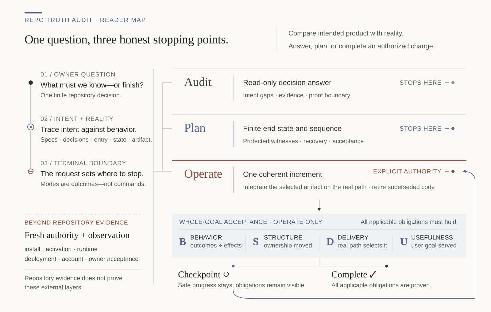

# Repo Truth Audit

[简体中文](README.zh-CN.md)

Formally: **Repository Operational Truth Audit**

**Recover the product agreement that still applies, compare it with what the repository
actually does, and carry an authorized change through implementation and verification.**

A Codex Skill for product-intent reconstruction, repository re-entry, migrations,
consolidation and legacy-path retirement. Use it for a focused engineering intervention; finish the agreed job
and return to normal development. It need not run on every task or every commit.

Current source version: `0.3.0` — published 2026-09-22.
Latest public release: [`v0.3.0`](https://github.com/IndelibleVivi/repo-truth-audit/releases/tag/v0.3.0) — product-intent comparison within Audit / Plan / Operate.

Version 0.3.0 adds intention-to-reality comparison from accepted specs,
decisions and scoped development conversations. See [current state](docs/current-state.md)
for its evidence and limits. The [0.2.1 receipt](docs/forward-0.2.1-receipt.md)
preserves historical evidence for that earlier release.

**The stable install below is pinned to the verified v0.3.0 tag.** Installing
the package still does not prove that a running host has discovered it; confirm
the selected Skill path and behavior in a fresh task.

[Using the Skill](docs/usage.md) · [0.3.0 behavior evidence](docs/forward-0.3.0-followup.md) ·
[Release procedure and v0.2.0 history](docs/release-preparation.md) · [v0.3.0 notes](docs/releases/v0.3.0.md)

## What problem it solves

You can read the code and still be unsure which implementation ships, which
module writes persistent state, or whether a green test covers the path users
actually run. Repo Truth Audit follows those relationships before judging a
repository decision or making an authorized structural change.

For example, extracting a formatter is only a checkpoint when the shipping
manifest still selects the old mixed writer. A complete replacement must also
move the callers, select the intended implementation, verify the artifact and
retire the superseded path where the agreed goal requires it.

## Product intent versus repository reality

A product can have tidy modules and green tests while its intended user journey
still fails. An export helper may exist without a reachable export command; a
README may promise offline use while the selected flow requires a remote service.
The Skill reconstructs the accepted product before judging those differences.

It reads SPEC and key decisions, or development conversations you specifically
provide or authorize. It preserves user goals, complete journeys, constraints,
non-goals and rationale. Later accepted decisions can revise older commitments;
brainstorming and assistant suggestions are not automatically requirements.

The comparison runs both ways: intended outcome to selected implementation and
evidence, then existing responsibilities back to a current purpose. It separates
missing capability, partial journeys, semantic drift, stale promises and unjustified
accumulation from deliberate evolution, explicit deferral and necessary compatibility.
No spec mention is not a deletion reason. Missing evidence is not missing behavior.

Audit gives the comparison; Plan proposes a bounded response; an explicitly
authorized Operate request closes the selected gaps and verifies user outcomes.
There is no fourth mode, product-completeness score, automatic chat scrape or
unrequested redesign. Operational-only audits still take the direct path.

## When to use it

Use it when the question is whether the implemented product still matches its
accepted intent, or when a local diff and a named assertion are insufficient: returning to
an unfamiliar or long-idle repository; checking migration or archive readiness;
reconciling source, package and installed identities; or separating tangled
responsibilities across real callers, state owners and delivery paths.

The intent route also applies to a new, small, tidy repository. Working features
may still impose unagreed manual steps on ordinary use. Compare that workflow
with the actual decisions, including delegated internal choices and later changes.

A functioning repository can still benefit when a concrete change repeatedly
crosses unrelated modules. Large files or two supported versions alone do not
justify a refactor. Keeping an intentional compatibility path can be correct.

## When not to use it

An isolated bug, ordinary PR review, formatting pass, or one known claim usually
belongs to the host's normal workflow. Dedicated security, license and dependency
reviews remain specialist work. There is no daily scan, automatic cleanup
campaign, scoring system or background service here.

## Invoke it

Start Codex in the **target repository** after installing and confirming discovery.
Describe your goal and whether edits are wanted. Audit, Plan and Operate are
behavior modes, not commands you must memorize.

| Your request | What the Skill should do |
| --- | --- |
| "Compare SPEC, accepted decisions and these supplied development notes with the working product. Explain missing, changed and obsolete behavior; do not edit." | **Audit:** reconstruct intent, trace gaps and distinguish valid evolution. |
| "Complete the local export/import journey required by the accepted spec, preserve the later CSV decision, and verify through the selected CLI." | **Operate:** close that finite product gap, including integration and evidence. |
| "Before I resume this repo, find which CLI and artifact are live. Do not edit." | **Audit:** answer the decision with evidence and explicit unknowns. |
| "Plan how to separate formatting from persistence. Stop before edits." | **Plan:** give a finite end state, steps, protection and acceptance criteria. |
| "Separate formatting from persistence, preserve CLI/config compatibility, update the real bundle and retire the old writer. Implement and verify locally." | **Operate:** perform the whole authorized change, including integration and acceptance. |
| "Clean everything." | Bounded read-only reconnaissance; resolve the goal and write boundary before edits. |

For an explicit invocation, start your request with
`Use $repository-operational-truth-audit to ...`.
The unchanged slug also names the old release, so invocation alone does not
prove that the installed copy has the 0.3.0 intent-comparison capability.

A local restructuring request can cover related source, tests, docs and old-source
retirement. It does not automatically authorize real-data migration, production
activation, installation, paid calls, push or release. A plan, example or saved
operation record cannot grant those permissions.

See the [usage guide](docs/usage.md) for copyable requests, a worked example,
resumption guidance, short definitions and instructions for coding agents.

## What a result looks like

**Not ready:** source tests pass, but the shipping manifest selects a stale artifact.

**Ready within repository scope:** stable and development paths have explicit
selection, separate identities and no unintended caller.

**Verified checkpoint, whole goal still open:** formatting is separated and its
behavior protected; moving the writer and switching delivery remain to be done.

**Complete at the agreed source + artifact layers:** the real selector uses the
new owners, required old paths are retired, and behavior and artifact checks pass.

## Output semantics

A finding connects a claim or live path to its mechanism, contradiction or
missing evidence, and the effect on the user's decision. The Skill separates
validated contradictions, false-green gates, shadow paths, intentional
multiplicity, harmless residue and decision-critical unknowns. A clean result
is bounded to the checked decision and snapshot, not a universal defect-free claim.

An authorized change is accepted against applicable **Behavior, Structure,
Delivery and Usefulness** obligations: correct outcomes and state effects;
actual separation or retirement; the selected delivery path; and achievement of the intended user outcome or relief of the
original development difficulty. A small follow-on change can test usefulness.
Not every task requires deployment or an extra feature probe.

Since 0.2.1, the Skill accounts for lasting tests/configuration as well as retired
responsibilities. It permits necessary new tests and authorized dirty-code
retirement, without net-line targets or per-test approval. Auxiliary methods
remain subject to actual host, user and project requirements.

Complete, checkpoint, blocked and aborted/recovered are distinct endings.
A checkpoint retains the original goal and remaining obligations. On resumption,
the host must invoke the Skill again and current source/effects must be checked
before more writes. It does not autonomously resume in the background.

## Install from the public release

For a fresh `v0.3.0` installation with intent comparison and Audit / Plan / Operate,
use the system installer:

```bash
python3 "${CODEX_HOME:-$HOME/.codex}/skills/.system/skill-installer/scripts/install-skill-from-github.py" \
  --repo IndelibleVivi/repo-truth-audit \
  --path skills/repository-operational-truth-audit \
  --ref v0.3.0
```

This is the verified public release. For an existing conflicting copy, use the
deliberate upgrade path below rather than deleting installed files.

## Validate or install from a source checkout

The commands below use Bash, Git and Python 3.10+. Clone into a **new** directory;
do not overwrite a working checkout. `main` can move beyond the tagged release:
record and review its exact commit before installing.

```bash
git clone https://github.com/IndelibleVivi/repo-truth-audit.git
cd repo-truth-audit
git rev-parse HEAD
git status --short --branch
python3 scripts/validate_architecture.py
python3 scripts/validate_repository.py
python3 -m unittest discover -s tests -p 'test_*.py'
python3 scripts/selftest.py
python3 evals/operation-lab/run_operation_lab.py
python3 evals/intent-lab/check_intent_subject.py
```

Validation above does not install the Skill. For a disposable installation test:

```bash
preview_root=$(mktemp -d)
python3 scripts/install_skill.py --dest "$preview_root"
```

That directory is a payload test, not a promise of host discovery. After reviewing
the source and choosing to change your daily installation, run **one** of:

```bash
# Fresh installation into the local installer's configured Skill root.
python3 scripts/install_skill.py
```

```bash
# Intentional upgrade; preserves the replaced Skill in a backup.
python3 scripts/install_skill.py --replace
```

The default destination is `$CODEX_HOME/skills`, or `~/.codex/skills`. Use `--dest`
only for a root your host actually discovers. Inspect the reported target,
backup and receipt. Do not edit the installed copy as source or manually overlay
new files onto the old directory. Restart/reload the host as needed, then use a
fresh task to confirm the selected Skill path and Audit/Plan/Operate behavior.
Installed bytes and observed activation are separate checks; see
[discovery troubleshooting](docs/usage.md#installation-and-discovery).

The local installer shares an explicit nine-file payload definition with
validation and digesting. Known runtime cache/bytecode never enters staging;
undeclared source files are rejected. The optional cited-byte checker requires
POSIX secure reads and fails closed elsewhere. CI covers macOS/Ubuntu with
Python 3.10/3.13. Bash fixtures and portable file identity do not establish full
native Windows operator support.

## Validation boundaries

Deterministic tests check packaging, fixtures and counterexamples; ordinary
validation makes no target-model or network call. The operation lab applies known
evaluator edits. The separate [forward receipt](docs/forward-0.2.0-receipt.md)
records real model Audit, Plan and Operate observations on synthetic subjects,
including a single-request whole-goal change and a formatter-only extension.
These are bounded 0.2.0 results, not proof of 0.2.1 method selection, arbitrary
production refactoring, crash recovery or real-data migration.

This Skill supplies a method and an optional byte checker. Host tools provide
execution and actual permission/sandbox controls. Servotab, Worker Routing and
Skill Field Lab are optional companions, never required runtime engines.
For related-tool distinctions, see [the usage guide](docs/usage.md#related-tools).

## Repository map

| Reader's job | Start here |
| --- | --- |
| Decide whether and how to use it | [Usage guide](docs/usage.md) |
| Execute the installed Skill | [Canonical SKILL.md](skills/repository-operational-truth-audit/SKILL.md), then its linked references |
| Maintain this repository | [AGENTS.md](AGENTS.md) and [product spec](docs/product-spec.md) |
| Understand proof and completion | [Evidence model](docs/evidence-model.md) |
| Inspect tested behavior and present state | [0.3.0 follow-up](docs/forward-0.3.0-followup.md), [original 0.3.0 receipt](docs/forward-0.3.0-receipt.md), [0.2.1 receipt](docs/forward-0.2.1-receipt.md), [0.2.0 receipt](docs/forward-0.2.0-receipt.md), [current state](docs/current-state.md) |
| Inspect the v0.3.0 release | [Release notes](docs/releases/v0.3.0.md), [release procedure and v0.2.0 history](docs/release-preparation.md) |
| Inspect architecture and research | [Architecture model](docs/architecture/README.md), [research basis](docs/research-basis.md) |

`evals/cases/` and `evals/operation-lab/` contain evaluator material, not target
instructions. `scripts/` and `tests/` own validation and local installation.
Public English/Chinese documents are paired; the installed runtime stays one
canonical Skill, with no additional documentation dependency.

## Architecture: what this diagram serves

The diagram answers one public-reader question:

> How does Repo Truth Audit turn an exact repository snapshot and a concrete
> owner intent into a bounded read-only answer, a decision-ready plan, or an
> authorized structural change or product convergence with verified completion without overclaiming
> evidence or external state?

It depicts the **Audit / Plan / Operate runtime contract**. Packaging,
installation, and release of this Skill remain a separate reader job. This
reader map intentionally compresses the full topology into its three honest
stopping points, Operate acceptance, and the external proof boundary.



In Operate, **B/S/D/U** is not a command set. It is four plain completion
questions:

| Check | What must be true |
| --- | --- |
| **Behavior** | Required outcomes, failures, compatibility, and state effects are correct. |
| **Structure** | Responsibilities really moved or the agreed old path really retired. |
| **Delivery** | The actual entrypoint, selector, or artifact uses the intended implementation. |
| **Usefulness** | The original change pressure is lower; where useful, a small follow-on change proves it. |

### Full semantic Mermaid map

Seven regions, 31 stable nodes, and 46 decision-bearing edges remain visible
alongside the reader-first overview.

The detailed map keeps every modeled relationship visible. Solid arrows are
in-scope evidence or implementation flow. Dotted arrows are conditional
authority or external-observation paths. Thick return arrows reopen diagnosis
or the next increment when evidence changes.

```mermaid
flowchart TB
  subgraph R00_PIN["01 · Pin intent + repository"]
    N00_OWNER_DECISION["Owner intent + terminal boundary<br/>Audit · Plan · Operate"]
    N01_START_PIN["Exact start pin<br/>physical/Git root · branch · HEAD · working tree"]
    N02_READ_ONLY["Read-only diagnosis contract<br/>Audit + Plan never edit · Operate has a separate gate"]
  end

  subgraph R10_RESOLVE["02 · Resolve authority + reachability"]
    N10_AUTHORITY["Current authority + accepted intent<br/>source owners · adopted specs · scoped decisions / conversations"]
    N11_LIVE_SELECTORS["Live entrypoints + selectors<br/>registrations · callers · pipelines · services · operator routes"]
    N12_OWNERSHIP_STATE["Ownership + state isolation<br/>selector · owner · callers · state · version · retirement intent"]
  end

  subgraph R20_TRAVERSE["03 · Traverse evidence layers"]
    N20_SOURCE_STATE["Source · config · durable state<br/>the layer that owns behavior or persistent truth"]
    N21_DERIVED_ARTIFACT["Generated · built · packaged · projected<br/>derivation identity and source-to-artifact relation"]
    N22_INSTALLED_IDENTITY["Installed · deployed identity<br/>an exact instance only when freshly observed"]
    N23_EVIDENCE_GATES["Evidence gates<br/>exact input · path · assertion · proof layer · observed identity"]
  end

  subgraph R30_CHALLENGE["04 · Challenge + adjudicate"]
    N30_TRACE["Intent / operational gap trace<br/>intent ↔ selected behavior → gap → user impact → proof"]
    N31_FALSE_GREEN["False-green challenge<br/>did the exact path run, observe the assertion, and fail when broken?"]
    N32_MULTIPLICITY["Multiplicity or shadow path?<br/>selection · ownership · isolation · callers · retirement intent"]
    N33_EXTERNAL_UNKNOWN["Decision-critical external unknown<br/>missing observation → prevented claim → affected decision → needed proof"]
    N34_SPECIALIST["Specialist adapter<br/>bounded material observation only; no default fan-out"]
  end

  subgraph R40_DECIDE["05 · Audit / Plan exits"]
    N40_OUTCOMES["Adjudication register<br/>missing / partial · drift · false green · accepted evolution<br/>deferral · residue · unknown · clean within scope"]
    N41_STOPPING{"Decision fixed-point test<br/>every candidate adjudicated · no new material evidence edge"}
    N42_DECISION_OUTPUT["Audit answer + proof boundary<br/>pin · live topology · traces · non-findings · verification · overhead"]
    N44_PLAN_CONTRACT["Plan contract · no mutation<br/>finite end state · sequence · witnesses · recovery · acceptance"]
    N43_END_REPIN["End re-pin + mutation statement<br/>mode · status · proof layer · ending identity"]
  end

  subgraph R60_OPERATE["06 · Authorize + operate"]
    N60_AGREED_OUTCOME["Finite agreed outcome<br/>change pressure · end state · applicable B/S/D/U obligations"]
    N61_IMPLEMENTATION_GATE["Explicit implementation gate<br/>action intent · target · finite outcome · effect authority"]
    N62_PROTECTED_WITNESSES["Protected behavior + structure witnesses<br/>selected entry · failures · state effects · falsifier"]
    N63_COHERENT_INCREMENT["Coherent increment<br/>reconcile inputs · implement · inspect diff · preserve owner work"]
    N64_VERIFY_CHALLENGE["Verify + challenge current source<br/>behavior · structure · delivery · strongest counterexample"]
    N65_CHECKPOINT["Verified checkpoint<br/>safe increment retained · original goal + remaining obligations stay visible"]
    N66_RECOVERY["Reconcile before resume<br/>absent · complete · partial · concurrent · unobservable effects"]
    N67_WHOLE_GOAL["Whole-goal B/S/D/U acceptance<br/>every applicable obligation proven at the requested layer"]
    N68_OPERATION_OUTPUT["Complete · checkpoint · blocked · recovered<br/>changes · effects · evidence · unknowns · final identity"]
  end

  subgraph R50_EXTERNAL["External proof boundary"]
    N50_OBSERVATION_GATE["Fresh observation gate<br/>exact scope + authorization + named current instance"]
    N51_EXTERNAL_STATE["Runtime · edge · device · account · owner acceptance<br/>explicitly unknown until freshly observed"]
  end

  %% E01_DECISION_BOUNDS_PIN
  N00_OWNER_DECISION -->|bounds| N01_START_PIN
  %% E02_PIN_BINDS_READ_ONLY
  N01_START_PIN -->|bind scope| N02_READ_ONLY
  %% E03_PIN_TO_AUTHORITY
  N02_READ_ONLY -->|observe| N10_AUTHORITY
  %% E04_AUTHORITY_TO_SELECTORS
  N10_AUTHORITY -->|resolve reachability| N11_LIVE_SELECTORS
  %% E05_SELECTORS_TO_OWNERSHIP
  N11_LIVE_SELECTORS -->|identify selection| N12_OWNERSHIP_STATE
  %% E06_OWNERSHIP_TO_SOURCE
  N12_OWNERSHIP_STATE -->|reach owner| N20_SOURCE_STATE
  %% E07_SOURCE_TO_ARTIFACT
  N20_SOURCE_STATE -->|derive| N21_DERIVED_ARTIFACT
  %% E08_ARTIFACT_TO_INSTALL
  N21_DERIVED_ARTIFACT -->|identify instance| N22_INSTALLED_IDENTITY
  %% E09_SOURCE_TO_GATES
  N20_SOURCE_STATE -->|prove layer| N23_EVIDENCE_GATES
  %% E10_ARTIFACT_TO_GATES
  N21_DERIVED_ARTIFACT -->|prove identity| N23_EVIDENCE_GATES
  %% E11_INSTALL_TO_GATES
  N22_INSTALLED_IDENTITY -->|prove exact instance| N23_EVIDENCE_GATES
  %% E12_AUTHORITY_TO_TRACE
  N10_AUTHORITY -->|claim surface| N30_TRACE
  %% E13_SELECTION_TO_TRACE
  N12_OWNERSHIP_STATE -->|mechanism + state| N30_TRACE
  %% E14_GATES_TO_TRACE
  N23_EVIDENCE_GATES -->|fresh validation| N30_TRACE
  %% E15_TRACE_TO_FALSE_GREEN
  N30_TRACE -->|challenge proof| N31_FALSE_GREEN
  %% E16_TRACE_TO_MULTIPLICITY
  N30_TRACE -->|adjudicate paths| N32_MULTIPLICITY
  %% E17_TRACE_TO_UNKNOWN
  N30_TRACE -->|name missing proof| N33_EXTERNAL_UNKNOWN
  %% E18_TRACE_TO_SPECIALIST
  N30_TRACE -. only if material .-> N34_SPECIALIST
  %% E19_SPECIALIST_TO_TRACE
  N34_SPECIALIST -. bounded observation .-> N30_TRACE
  %% E20_UNKNOWN_TO_GATE
  N33_EXTERNAL_UNKNOWN -. scope + authorize .-> N50_OBSERVATION_GATE
  %% E21_GATE_TO_EXTERNAL
  N50_OBSERVATION_GATE -. fresh named observation .-> N51_EXTERNAL_STATE
  %% E22_EXTERNAL_TO_TRACE
  N51_EXTERNAL_STATE -. observed evidence only .-> N30_TRACE
  %% E23_TRACE_TO_OUTCOMES
  N30_TRACE -->|adjudicate| N40_OUTCOMES
  %% E24_FALSE_GREEN_TO_OUTCOMES
  N31_FALSE_GREEN -->|record proof result| N40_OUTCOMES
  %% E25_MULTIPLICITY_TO_OUTCOMES
  N32_MULTIPLICITY -->|record path judgment| N40_OUTCOMES
  %% E26_UNKNOWN_TO_OUTCOMES
  N33_EXTERNAL_UNKNOWN -->|retain explicit unknown| N40_OUTCOMES
  %% E27_OUTCOMES_TO_STOP
  N40_OUTCOMES -->|test completeness| N41_STOPPING
  %% E28_STOP_FEEDBACK
  N41_STOPPING == new material evidence edge ==> N10_AUTHORITY
  %% E29_STOP_TO_OUTPUT
  N41_STOPPING -->|fixed point reached| N42_DECISION_OUTPUT
  %% E30_OUTPUT_TO_REPIN
  N42_DECISION_OUTPUT -->|close receipt| N43_END_REPIN
  %% E31_STOP_TO_PLAN
  N41_STOPPING -->|Plan requested| N44_PLAN_CONTRACT
  %% E32_PLAN_TO_REPIN
  N44_PLAN_CONTRACT -->|close without mutation| N43_END_REPIN
  %% E33_STOP_TO_OUTCOME
  N41_STOPPING -. explicit Operate request .-> N60_AGREED_OUTCOME
  %% E34_OUTCOME_TO_GATE
  N60_AGREED_OUTCOME -. match effect authority .-> N61_IMPLEMENTATION_GATE
  %% E35_GATE_TO_WITNESSES
  N61_IMPLEMENTATION_GATE -->|authority confirmed| N62_PROTECTED_WITNESSES
  %% E36_WITNESSES_TO_INCREMENT
  N62_PROTECTED_WITNESSES -->|protect + implement| N63_COHERENT_INCREMENT
  %% E37_INCREMENT_TO_VERIFY
  N63_COHERENT_INCREMENT -->|inspect diff + effects| N64_VERIFY_CHALLENGE
  %% E38_VERIFY_TO_CHECKPOINT
  N64_VERIFY_CHALLENGE -->|current evidence| N65_CHECKPOINT
  %% E39_CHECKPOINT_FEEDBACK
  N65_CHECKPOINT == remaining obligations ==> N60_AGREED_OUTCOME
  %% E40_CHECKPOINT_TO_GOAL
  N65_CHECKPOINT -->|all increments ready| N67_WHOLE_GOAL
  %% E41_CHECKPOINT_TO_RECOVERY
  N65_CHECKPOINT -. interrupted or drifted .-> N66_RECOVERY
  %% E42_RECOVERY_FEEDBACK
  N66_RECOVERY == reconcile + resume ==> N60_AGREED_OUTCOME
  %% E43_GOAL_TO_OUTPUT
  N67_WHOLE_GOAL -->|applicable obligations pass| N68_OPERATION_OUTPUT
  %% E44_OPERATION_TO_REPIN
  N68_OPERATION_OUTPUT -->|close at proven layer| N43_END_REPIN
  %% E45_GOAL_TO_EXTERNAL
  N67_WHOLE_GOAL -. external layer included .-> N50_OBSERVATION_GATE
  %% E46_EXTERNAL_TO_GOAL
  N51_EXTERNAL_STATE -. observed completion evidence .-> N67_WHOLE_GOAL
```



The renderer-neutral model, stable semantic IDs, evidence mapping, paired SVG
reader maps, and complete Mermaid source contract live in
[docs/architecture/](docs/architecture/README.md).

## Licensing

This repository is **source-available, not OSI open source**.
Functional materials use the [Sustainable Use License 1.0](LICENSE).
Standalone public documentation and independent diagrams use
[CC BY-NC-SA 4.0](LICENSE-DOCUMENTATION.md). Consult
[LICENSING.md](LICENSING.md) for the exact path map and full conditions.
No external Skill text or source code is vendored; conceptual sources are
recorded in [the research basis](docs/research-basis.md).
