# Repo Truth Audit

[English](README.md)

正式名称：**Repository Operational Truth Audit**

一个独立、evidence-led 的 Codex Skill：恢复长期演化仓库**今天实际上通过什么运行**，
并在用户明确要求时，把有限结构变更一路做到实现与验证。

当前 source candidate：`0.2.0`
最新公开 release：`v0.1.0`

Skill invocation slug：`repository-operational-truth-audit`（保持不变）。

它不是 generic repo score、public-launch checklist 或通用 automatic fixer。它沿着与
决策有关的 entrypoints、selectors、authority owners、durable state、derived artifacts、
installed identities、evidence gates 与明确 external boundaries 穿行。Audit 默认只读；
Plan 在编辑前停止；显式 Operate 请求可以继续完成 protected witnesses、coherent increments、
recovery-aware checkpoints、superseded path retirement，以及请求 source/delivery layer 的验收。

## 它解决什么问题

普通 code review 从一个 bounded change 开始；普通 verification 从一个 named claim
开始。Repository Operational Truth Audit 用在这两个起点都不充分的时候：

- 几个月没碰这个 repo，现在真正 live 的路径是哪一条？
- migration 或 safe archive 前，哪些 source、state、package 与 installed identity
  仍然重要？
- source、generated artifact、distribution package、installed copy、documentation 与
  tests 是否描述同一条 operational path？
- 一个 green test 或 receipt 到底证明哪一层？被声称保护的 contract 破坏后，它会不会
  仍然 green？
- 两套 mode 是有意选择且相互隔离，还是其中一条已经变成无人承认的 shadow path？
- restore 或 release claim 若依赖无法观察的 remote schema、secret、dashboard
  setting、device 或 human step，当前 decision 到底能诚实地下到哪里？
- 当 formatting、persistence、selection 与 delivery 已经纠缠在一起，第一处值得改变的
  结构边界是什么？
- Refactor 是否既保住行为，又真的迁移了 ownership 与 selected artifact，还是只加了一层 facade？
- 改完之后，下一个小功能是否真的可以不再穿过旧 owners？

## 一个结果会长什么样

**Not ready**

> Source tests 虽然通过，但 `distribution.json` 仍然选中 stale artifact。

**Ready within repository scope**

> Stable 与 development 两条路径都有明确 selector 和隔离 identity，也不存在
> cross-boundary caller。

**Verified checkpoint，但完整目标仍未完成**

> Formatting 已隔离且行为受保护，但 manifest 仍选择 legacy writer；这一步可以安全保留，
> 不能宣称整场改造完成。

**在约定 source + artifact 层完成**

> Shipping selector 已选择新 owners，旧 writer 不可达且已退役，behavior/state witnesses
> 通过，declared artifact 与目标实现一致。

## 架构图究竟 serve 什么

这张图只回答一个 public reader question：

> Repo Truth Audit 如何把精确仓库快照与明确所有者意图转化为有界只读答案、可执行计划，
> 或经过验证完成的获授权结构变更，同时不夸大证据或外部状态？

因此它画的是 **Audit / Plan / Operate 运行契约**。这个 Skill 自身的 packaging、
installation 与 release 属于另一项 reader job。

实线箭头表示范围内 evidence 或 implementation flow；点线箭头表示有条件的 authority、
specialist 或外部观察；粗回箭头表示新证据重新打开诊断或下一 increment。

```mermaid
flowchart TB
  subgraph R00_PIN["01 · 钉住意图与仓库"]
    N00_OWNER_DECISION["所有者意图与终点边界<br/>Audit · Plan · Operate"]
    N01_START_PIN["精确起始钉点<br/>physical/Git root · branch · HEAD · working tree"]
    N02_READ_ONLY["只读诊断契约<br/>Audit + Plan 不编辑 · Operate 另有实施 gate"]
  end

  subgraph R10_RESOLVE["02 · 解析权威与可达路径"]
    N10_AUTHORITY["当前权威所有者<br/>source · config · durable state · runbooks · history"]
    N11_LIVE_SELECTORS["实际入口与 selectors<br/>registrations · callers · pipelines · services · operator routes"]
    N12_OWNERSHIP_STATE["所有权与状态隔离<br/>selector · owner · callers · state · version · retirement intent"]
  end

  subgraph R20_TRAVERSE["03 · 穿行证据层"]
    N20_SOURCE_STATE["Source · config · durable state<br/>拥有行为或持久事实的层"]
    N21_DERIVED_ARTIFACT["Generated · built · packaged · projected<br/>derivation identity 与 source-to-artifact relation"]
    N22_INSTALLED_IDENTITY["Installed · deployed identity<br/>仅记录范围内得到新鲜观察的精确 instance"]
    N23_EVIDENCE_GATES["证据 gates<br/>exact input · path · assertion · proof layer · observed identity"]
  end

  subgraph R30_CHALLENGE["04 · 挑战与裁定"]
    N30_TRACE["承载决策的候选 trace<br/>claim → mechanism/state → gap → impact → fresh validation"]
    N31_FALSE_GREEN["False-green challenge<br/>exact path 是否运行、assertion 是否可见、破坏后是否失败？"]
    N32_MULTIPLICITY["Intentional multiplicity 还是 shadow path？<br/>选择 · 所有权 · 隔离 · callers · retirement intent"]
    N33_EXTERNAL_UNKNOWN["决策关键的外部未知<br/>缺失观察 → 被阻断 claim → 受影响 decision → 所需证明"]
    N34_SPECIALIST["Specialist adapter<br/>只做有实质意义的有限观察；不默认 fan-out"]
  end

  subgraph R40_DECIDE["05 · Audit / Plan 出口"]
    N40_OUTCOMES["裁定结果簿<br/>矛盾 · false green · shadow path · intentional multiplicity<br/>residue · unknown · external boundary · 范围内 clean"]
    N41_STOPPING{"决策固定点测试<br/>每个候选项均已裁定 · 不再有新的实质证据边"}
    N42_DECISION_OUTPUT["Audit 答案与证明边界<br/>pin · live topology · traces · non-findings · verification · overhead"]
    N44_PLAN_CONTRACT["Plan contract · 不修改目标<br/>有限 end state · sequence · witnesses · recovery · acceptance"]
    N43_END_REPIN["结束复钉与 mutation statement<br/>mode · status · proof layer · ending identity"]
  end

  subgraph R60_OPERATE["06 · 授权与实施"]
    N60_AGREED_OUTCOME["有限约定结果<br/>change pressure · end state · 适用 B/S/D/U obligations"]
    N61_IMPLEMENTATION_GATE["显式实施 gate<br/>action intent · target · finite outcome · effect authority"]
    N62_PROTECTED_WITNESSES["受保护的 behavior + structure witnesses<br/>selected entry · failures · state effects · falsifier"]
    N63_COHERENT_INCREMENT["Coherent increment<br/>核对 inputs · 实现 · 检查 diff · 保留 owner work"]
    N64_VERIFY_CHALLENGE["验证并挑战当前 source<br/>behavior · structure · delivery · 最强反例"]
    N65_CHECKPOINT["Verified checkpoint<br/>保留安全 increment · 原目标与剩余 obligations 持续可见"]
    N66_RECOVERY["续做前重新核对<br/>absent · complete · partial · concurrent · unobservable effects"]
    N67_WHOLE_GOAL["完整目标 B/S/D/U 验收<br/>每个适用 obligation 在请求层得到证明"]
    N68_OPERATION_OUTPUT["Complete · checkpoint · blocked · recovered<br/>changes · effects · evidence · unknowns · final identity"]
  end

  subgraph R50_EXTERNAL["外部证明边界"]
    N50_OBSERVATION_GATE["新鲜观察 gate<br/>精确范围 + 明确授权 + 具名当前 instance"]
    N51_EXTERNAL_STATE["Runtime · edge · device · account · owner acceptance<br/>得到新鲜观察前始终是显式未知"]
  end

  %% E01_DECISION_BOUNDS_PIN
  N00_OWNER_DECISION -->|限定| N01_START_PIN
  %% E02_PIN_BINDS_READ_ONLY
  N01_START_PIN -->|绑定范围| N02_READ_ONLY
  %% E03_PIN_TO_AUTHORITY
  N02_READ_ONLY -->|观察| N10_AUTHORITY
  %% E04_AUTHORITY_TO_SELECTORS
  N10_AUTHORITY -->|解析可达性| N11_LIVE_SELECTORS
  %% E05_SELECTORS_TO_OWNERSHIP
  N11_LIVE_SELECTORS -->|识别选择| N12_OWNERSHIP_STATE
  %% E06_OWNERSHIP_TO_SOURCE
  N12_OWNERSHIP_STATE -->|到达所有者| N20_SOURCE_STATE
  %% E07_SOURCE_TO_ARTIFACT
  N20_SOURCE_STATE -->|派生| N21_DERIVED_ARTIFACT
  %% E08_ARTIFACT_TO_INSTALL
  N21_DERIVED_ARTIFACT -->|识别实例| N22_INSTALLED_IDENTITY
  %% E09_SOURCE_TO_GATES
  N20_SOURCE_STATE -->|证明本层| N23_EVIDENCE_GATES
  %% E10_ARTIFACT_TO_GATES
  N21_DERIVED_ARTIFACT -->|证明身份| N23_EVIDENCE_GATES
  %% E11_INSTALL_TO_GATES
  N22_INSTALLED_IDENTITY -->|证明精确实例| N23_EVIDENCE_GATES
  %% E12_AUTHORITY_TO_TRACE
  N10_AUTHORITY -->|claim surface| N30_TRACE
  %% E13_SELECTION_TO_TRACE
  N12_OWNERSHIP_STATE -->|mechanism + state| N30_TRACE
  %% E14_GATES_TO_TRACE
  N23_EVIDENCE_GATES -->|新鲜验证| N30_TRACE
  %% E15_TRACE_TO_FALSE_GREEN
  N30_TRACE -->|挑战证明| N31_FALSE_GREEN
  %% E16_TRACE_TO_MULTIPLICITY
  N30_TRACE -->|裁定路径| N32_MULTIPLICITY
  %% E17_TRACE_TO_UNKNOWN
  N30_TRACE -->|命名缺失证明| N33_EXTERNAL_UNKNOWN
  %% E18_TRACE_TO_SPECIALIST
  N30_TRACE -. 仅在实质相关时 .-> N34_SPECIALIST
  %% E19_SPECIALIST_TO_TRACE
  N34_SPECIALIST -. 有限观察 .-> N30_TRACE
  %% E20_UNKNOWN_TO_GATE
  N33_EXTERNAL_UNKNOWN -. 限定范围并授权 .-> N50_OBSERVATION_GATE
  %% E21_GATE_TO_EXTERNAL
  N50_OBSERVATION_GATE -. 新鲜具名观察 .-> N51_EXTERNAL_STATE
  %% E22_EXTERNAL_TO_TRACE
  N51_EXTERNAL_STATE -. 仅返回已观察证据 .-> N30_TRACE
  %% E23_TRACE_TO_OUTCOMES
  N30_TRACE -->|裁定| N40_OUTCOMES
  %% E24_FALSE_GREEN_TO_OUTCOMES
  N31_FALSE_GREEN -->|记录证明结果| N40_OUTCOMES
  %% E25_MULTIPLICITY_TO_OUTCOMES
  N32_MULTIPLICITY -->|记录路径判断| N40_OUTCOMES
  %% E26_UNKNOWN_TO_OUTCOMES
  N33_EXTERNAL_UNKNOWN -->|保留显式未知| N40_OUTCOMES
  %% E27_OUTCOMES_TO_STOP
  N40_OUTCOMES -->|测试完备性| N41_STOPPING
  %% E28_STOP_FEEDBACK
  N41_STOPPING == 新的实质证据边 ==> N10_AUTHORITY
  %% E29_STOP_TO_OUTPUT
  N41_STOPPING -->|抵达固定点| N42_DECISION_OUTPUT
  %% E30_OUTPUT_TO_REPIN
  N42_DECISION_OUTPUT -->|闭合回执| N43_END_REPIN
  %% E31_STOP_TO_PLAN
  N41_STOPPING -->|请求 Plan| N44_PLAN_CONTRACT
  %% E32_PLAN_TO_REPIN
  N44_PLAN_CONTRACT -->|不修改并闭合| N43_END_REPIN
  %% E33_STOP_TO_OUTCOME
  N41_STOPPING -. 显式 Operate 请求 .-> N60_AGREED_OUTCOME
  %% E34_OUTCOME_TO_GATE
  N60_AGREED_OUTCOME -. 匹配 effect authority .-> N61_IMPLEMENTATION_GATE
  %% E35_GATE_TO_WITNESSES
  N61_IMPLEMENTATION_GATE -->|授权已确认| N62_PROTECTED_WITNESSES
  %% E36_WITNESSES_TO_INCREMENT
  N62_PROTECTED_WITNESSES -->|保护并实现| N63_COHERENT_INCREMENT
  %% E37_INCREMENT_TO_VERIFY
  N63_COHERENT_INCREMENT -->|检查 diff 与 effects| N64_VERIFY_CHALLENGE
  %% E38_VERIFY_TO_CHECKPOINT
  N64_VERIFY_CHALLENGE -->|当前证据| N65_CHECKPOINT
  %% E39_CHECKPOINT_FEEDBACK
  N65_CHECKPOINT == 剩余 obligations ==> N60_AGREED_OUTCOME
  %% E40_CHECKPOINT_TO_GOAL
  N65_CHECKPOINT -->|所有 increments 已就绪| N67_WHOLE_GOAL
  %% E41_CHECKPOINT_TO_RECOVERY
  N65_CHECKPOINT -. 中断或 drift .-> N66_RECOVERY
  %% E42_RECOVERY_FEEDBACK
  N66_RECOVERY == 核对并续做 ==> N60_AGREED_OUTCOME
  %% E43_GOAL_TO_OUTPUT
  N67_WHOLE_GOAL -->|适用 obligations 通过| N68_OPERATION_OUTPUT
  %% E44_OPERATION_TO_REPIN
  N68_OPERATION_OUTPUT -->|在已证明层闭合| N43_END_REPIN
  %% E45_GOAL_TO_EXTERNAL
  N67_WHOLE_GOAL -. 纳入 external layer .-> N50_OBSERVATION_GATE
  %% E46_EXTERNAL_TO_GOAL
  N51_EXTERNAL_STATE -. 已观察完成证据 .-> N67_WHOLE_GOAL
```



Renderer-neutral model、稳定 semantic IDs、evidence mapping 与两份 Mermaid source
contract 位于 [`docs/architecture/`](docs/architecture/README.zh-CN.md)。

## 什么时候使用

当一个明确决策依赖对当前 repo topology 的重建时使用，尤其包括：

- 长期闲置 repo 的 re-entry；
- migration、machine move、consolidation 或 archival readiness；
- source / generated artifact / package / installed copy 对账；
- 当前 product docs、durable agent instructions、runbooks、status surfaces 或 receipts
  之间的 authority drift；
- assertion 可能没有覆盖其声称 contract 的 false-green gate；
- stable/development、legacy/current、local/remote 或 source/deployment 路径的归属与
  选择不明确；
- repo claim 所依赖的决定性 external state 尚未被观察；
- live ownership 与 delivery path 不清楚时，为有限 extraction、consolidation、replacement
  或 retirement 制定计划；
- 用户明确要求实施并验证结构结果，而不是在 audit handoff 处停止。

## 什么时候不要使用

以下任务应交给更窄的 owner：

- review 一个 diff、commit、branch 或 pull request；
- verify 一个已经明确的 claim；
- 修复一个不涉及 repository topology 的孤立已知 bug；
- 做 license、security、compliance 或 dependency 专项审计；
- generic repo hygiene 或 documentation cleanup；
- 在没有 repo-state decision 与明确授权时，检查或改变 live host、account、database、
  browser、deployment 或 owner-controlled surface。

Audit 默认只读，Plan 不编辑目标。Operate 需要显式 implementation request，且仍受真实
authority 限制。Local source authorization 不等于公共 API 删除、durable-data mutation、
install、deployment、push、account action 或 release。

## 从公开 release 安装

使用 system Skill installer，并固定 release tag：

```bash
python3 "${CODEX_HOME:-$HOME/.codex}/skills/.system/skill-installer/scripts/install-skill-from-github.py" \
  --repo IndelibleVivi/repo-truth-audit \
  --path skills/repository-operational-truth-audit \
  --ref v0.1.0
```

安装得到的是 derived local copy；canonical source 仍然是本 repo。成功 install 只证明
installed bytes，Codex 在后续 turn 的 discovery 是另一个必须单独观察的边界。

`v0.1.0` tag 保持 immutable，并保留 release 时的正式全名 display metadata。当前 `main`
承载尚未发布的 `0.2.0` Audit / Plan / Operate source candidate；安装 `v0.1.0` 不会获得这些
候选能力。Skill slug 保持不变。

## 从 source checkout 验证或安装

```bash
git clone https://github.com/IndelibleVivi/repo-truth-audit.git
cd repo-truth-audit

python3 scripts/validate_architecture.py
python3 scripts/validate_repository.py
python3 -m unittest discover -s tests -p 'test_*.py'
python3 scripts/selftest.py
python3 evals/operation-lab/run_operation_lab.py
python3 scripts/install_skill.py
```

Tracked text files 通过 `.gitattributes` 固定为 LF，因此普通 Windows checkout 也会
保留 repository validation 使用的精确 license hashes。Skill digest 按规范化后的
POSIX relative path 排序，使 Windows、macOS 与 Linux 的 source/install receipts
可互相比对。Fixture self-test 仍然需要 Bash；这并不表示全部 operator commands 已在
Windows 上变成 shell-native。

Local installer 会拒绝覆盖内容不同的目标。只有在明确升级时才使用 `--replace`；被替换
的 copy 会保留在可恢复 backup 中，installer 同时写入 provenance receipt。

## 调用方式

Audit（只读）：

```text
在我重新进入这个 repo 前，用 $repository-operational-truth-audit 重建它当前的
operational truth。重点看哪些 entrypoints 与 artifacts 仍然 live、现有 tests 真正证明了
什么，以及哪些 unknowns 会改变 re-entry decision。保持只读。
```

Plan（不编辑目标）：

```text
用 $repository-operational-truth-audit 规划怎样把 formatting 与 durable writes 分开。
追踪实际 CLI 与 distribution selector，保留当前行为，定义 structure/delivery 验收，
并在编辑前停止。
```

Operate（显式实施授权）：

```text
用 $repository-operational-truth-audit 把 formatting 与 durable writes 分开，保留当前
CLI/config 兼容，切换真实 distribution，退役旧 writer，并验证 behavior、structure、
delivery 以及下一次 formatter-only extension。实施本地 source change。
```

一次完整 engagement 绑定：

```text
一个 owner decision + 一个精确 repository snapshot
  -> 当前 authority 与 live selectors
  -> source / configuration / durable state
  -> generated / built / packaged / projected artifacts
  -> installed 或 deployed identity（仅在得到新鲜观察时）
  -> challenge、adjudication 与显式 external unknowns
  -> Audit answer、Plan boundary 或显式 Operate authority
  -> protected behavior + structural witnesses
  -> coherent increments + checkpoint/recovery loop
  -> behavior / structure / delivery / usefulness acceptance
  -> bounded result + proof limits + end re-pin
```

Tests、receipts、status documents 与 successful commands 都只是 evidence surfaces。
它们只证明自己实际观察到的 exact input、identity、assertion 与 proof layer。

## 输出语义

一个 material finding 必须闭合：

```text
claim 或 live surface
  -> mechanism 或 state
  -> contradiction 或 evidence gap
  -> 具体 decision impact
  -> fresh validation
```

裁定语义区分：

- validated contradiction；
- false-green evidence；
- shadow path；
- intentional multiplicity；
- non-material residue；
- decision-critical unknown；
- external/environment/policy boundary；
- explicit audit object 内的 clean result。

这些是 decision meanings，不是 score，也不是强制 report template。Clean result 不等于
“这个 repo 没有任何缺陷”，而是 pinned object 内没有留下 material contradiction 或
decision-critical unknown。

Operate 把 checkpoint 与完整目标完成分开，并核对适用 obligations：

- **behavior：**outputs、failures、compatibility 与 state effects；
- **structure：**ownership/dependency change 与真实 retirement，而不是 facade；
- **delivery：**请求覆盖的 manifest、package、installation 或 runtime selector；
- **usefulness：**具体 change pressure 得到缓解，并在可行时用小型 follow-on change 证明。

Terminal status 为 complete、checkpoint、blocked 或 aborted/recovered。Tests 通过、worker
completion、byte match 或 state JSON field 都不能单独把一种 status 升级成另一种。

## Repository map

| Path | Authority |
| --- | --- |
| `skills/repository-operational-truth-audit/` | Canonical Skill router、progressive Audit/Operate/Recovery references、可选 cited-byte helper 与 UI metadata |
| `docs/product-spec.md` | 完整 accepted product 与 acceptance contract |
| `docs/evidence-model.md` | Proof、finding、checkpoint/completion、recovery 与 stopping semantics |
| `docs/architecture/` | Renderer-neutral model 与 README 中分开的中英文 Mermaid contract |
| `docs/forward-behavior-receipt.md` | 历史 public-safe `v0.1.0` Audit-only forward evidence |
| `docs/forward-0.2.0-receipt.md` | Public-safe `0.2.0` Audit regression 与 two-increment Operate evidence |
| `docs/research-basis.md` | Public-safe research provenance 与 source decisions |
| `docs/current-state.md` | 易变化的 source、Git、install、CI 与 publication truth |
| `evals/cases/` | Controlled 只读 behavior cases；expected artifacts 仅供 evaluator 使用 |
| `evals/operation-lab/` | Deterministic known-patch rehearsal 与 anti-false-completion controls；不是 model evidence |
| `scripts/` | Architecture/repository validation、fixture self-test 与 transactional install |
| `tests/` | Repository、architecture、evidence-helper、operation-lab、fixture 与 installer regressions |

中文文档使用 `.zh-CN.md` 后缀，与英文版保持同一文档边界，不把两种语言机械混排进
一个文件。

## 验证边界

Ordinary validation 与受控 operation lab 不调用 target model，也不执行 network、browser、
account、deployment 或 live-system mutation。Lab 只对 synthetic subject 应用 evaluator
编写的已知 edits，不证明 autonomous model performance。CI workflow 在 macOS 与 Ubuntu 上
分别使用 Python 3.10 和 3.13。

Skill Field Lab 可以在 disposable workspaces 中评估 controlled cases，但它只是可选
evaluation infrastructure，不是 runtime dependency，也不拥有这个 Skill。

## 许可

本 repo 是 **source-available，不是 OSI open source**。

- Functional materials——包括 Skill、scripts、tests、CI、evals 与 functional repository
  contracts——使用 [Sustainable Use License 1.0](LICENSE)。完整条款允许个人、
  非商业与内部商业使用；向他人分发或提供时，必须保持免费且非商业。
- 独立的 README、changelogs、公开 documentation 与 `docs/` 下的独立 diagrams 使用
  [CC BY-NC-SA 4.0](LICENSE-DOCUMENTATION.zh-CN.md)。
- [`LICENSING.zh-CN.md`](LICENSING.zh-CN.md) 给出精确 path map 与 exceptions；未来若
  引入第三方材料，它们仍受各自条款约束。

公开可见不会消除这些条件。本 repo 没有 vendored external Skill text 或 source code；
概念性 research provenance 记录在
[`docs/research-basis.zh-CN.md`](docs/research-basis.zh-CN.md)。
