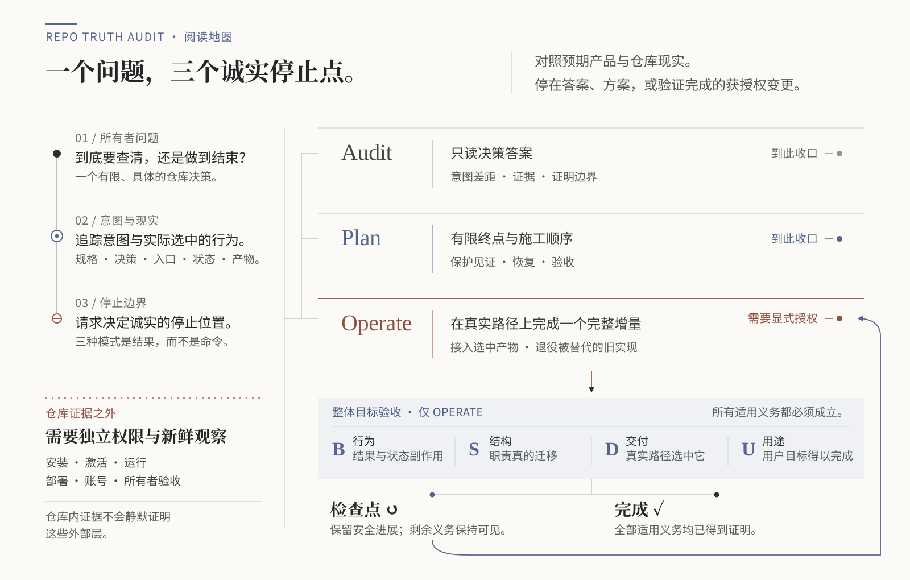

```mermaid
flowchart TB
  subgraph R00_PIN["01 · 钉住意图与仓库"]
    N00_OWNER_DECISION["所有者意图与终点边界<br/>Audit · Plan · Operate"]
    N01_START_PIN["精确起始钉点<br/>physical/Git root · branch · HEAD · working tree"]
    N02_READ_ONLY["只读诊断契约<br/>Audit + Plan 不编辑 · Operate 另有实施 gate"]
  end

  subgraph R10_RESOLVE["02 · 解析权威与可达路径"]
    N10_AUTHORITY["当前权威所有者<br/>source · config · durable state · runbooks · history"]
    N11_LIVE_SELECTORS["实际入口与 selectors<br/>registrations · callers · pipelines · services · operator routes"]
    N12_OWNERSHIP_STATE["所有权与状态隔离<br/>selector · owner · callers · state · version · retirement intent"]
  end

  subgraph R20_TRAVERSE["03 · 穿行证据层"]
    N20_SOURCE_STATE["Source · config · durable state<br/>拥有行为或持久事实的层"]
    N21_DERIVED_ARTIFACT["Generated · built · packaged · projected<br/>derivation identity 与 source-to-artifact relation"]
    N22_INSTALLED_IDENTITY["Installed · deployed identity<br/>仅记录范围内得到新鲜观察的精确 instance"]
    N23_EVIDENCE_GATES["证据 gates<br/>exact input · path · assertion · proof layer · observed identity"]
  end

  subgraph R30_CHALLENGE["04 · 挑战与裁定"]
    N30_TRACE["承载决策的候选 trace<br/>claim → mechanism/state → gap → impact → fresh validation"]
    N31_FALSE_GREEN["False-green challenge<br/>exact path 是否运行、assertion 是否可见、破坏后是否失败？"]
    N32_MULTIPLICITY["Intentional multiplicity 还是 shadow path？<br/>选择 · 所有权 · 隔离 · callers · retirement intent"]
    N33_EXTERNAL_UNKNOWN["决策关键的外部未知<br/>缺失观察 → 被阻断 claim → 受影响 decision → 所需证明"]
    N34_SPECIALIST["Specialist adapter<br/>只做有实质意义的有限观察；不默认 fan-out"]
  end

  subgraph R40_DECIDE["05 · Audit / Plan 出口"]
    N40_OUTCOMES["裁定结果簿<br/>矛盾 · false green · shadow path · intentional multiplicity<br/>residue · unknown · external boundary · 范围内 clean"]
    N41_STOPPING{"决策固定点测试<br/>每个候选项均已裁定 · 不再有新的实质证据边"}
    N42_DECISION_OUTPUT["Audit 答案与证明边界<br/>pin · live topology · traces · non-findings · verification · overhead"]
    N44_PLAN_CONTRACT["Plan contract · 不修改目标<br/>有限 end state · sequence · witnesses · recovery · acceptance"]
    N43_END_REPIN["结束复钉与 mutation statement<br/>mode · status · proof layer · ending identity"]
  end

  subgraph R60_OPERATE["06 · 授权与实施"]
    N60_AGREED_OUTCOME["有限约定结果<br/>change pressure · end state · 适用 B/S/D/U obligations"]
    N61_IMPLEMENTATION_GATE["显式实施 gate<br/>action intent · target · finite outcome · effect authority"]
    N62_PROTECTED_WITNESSES["受保护的 behavior + structure witnesses<br/>selected entry · failures · state effects · falsifier"]
    N63_COHERENT_INCREMENT["Coherent increment<br/>核对 inputs · 实现 · 检查 diff · 保留 owner work"]
    N64_VERIFY_CHALLENGE["验证并挑战当前 source<br/>behavior · structure · delivery · 最强反例"]
    N65_CHECKPOINT["Verified checkpoint<br/>保留安全 increment · 原目标与剩余 obligations 持续可见"]
    N66_RECOVERY["续做前重新核对<br/>absent · complete · partial · concurrent · unobservable effects"]
    N67_WHOLE_GOAL["完整目标 B/S/D/U 验收<br/>每个适用 obligation 在请求层得到证明"]
    N68_OPERATION_OUTPUT["Complete · checkpoint · blocked · recovered<br/>changes · effects · evidence · unknowns · final identity"]
  end

  subgraph R50_EXTERNAL["外部证明边界"]
    N50_OBSERVATION_GATE["新鲜观察 gate<br/>精确范围 + 明确授权 + 具名当前 instance"]
    N51_EXTERNAL_STATE["Runtime · edge · device · account · owner acceptance<br/>得到新鲜观察前始终是显式未知"]
  end

  %% E01_DECISION_BOUNDS_PIN
  N00_OWNER_DECISION -->|限定| N01_START_PIN
  %% E02_PIN_BINDS_READ_ONLY
  N01_START_PIN -->|绑定范围| N02_READ_ONLY
  %% E03_PIN_TO_AUTHORITY
  N02_READ_ONLY -->|观察| N10_AUTHORITY
  %% E04_AUTHORITY_TO_SELECTORS
  N10_AUTHORITY -->|解析可达性| N11_LIVE_SELECTORS
  %% E05_SELECTORS_TO_OWNERSHIP
  N11_LIVE_SELECTORS -->|识别选择| N12_OWNERSHIP_STATE
  %% E06_OWNERSHIP_TO_SOURCE
  N12_OWNERSHIP_STATE -->|到达所有者| N20_SOURCE_STATE
  %% E07_SOURCE_TO_ARTIFACT
  N20_SOURCE_STATE -->|派生| N21_DERIVED_ARTIFACT
  %% E08_ARTIFACT_TO_INSTALL
  N21_DERIVED_ARTIFACT -->|识别实例| N22_INSTALLED_IDENTITY
  %% E09_SOURCE_TO_GATES
  N20_SOURCE_STATE -->|证明本层| N23_EVIDENCE_GATES
  %% E10_ARTIFACT_TO_GATES
  N21_DERIVED_ARTIFACT -->|证明身份| N23_EVIDENCE_GATES
  %% E11_INSTALL_TO_GATES
  N22_INSTALLED_IDENTITY -->|证明精确实例| N23_EVIDENCE_GATES
  %% E12_AUTHORITY_TO_TRACE
  N10_AUTHORITY -->|claim surface| N30_TRACE
  %% E13_SELECTION_TO_TRACE
  N12_OWNERSHIP_STATE -->|mechanism + state| N30_TRACE
  %% E14_GATES_TO_TRACE
  N23_EVIDENCE_GATES -->|新鲜验证| N30_TRACE
  %% E15_TRACE_TO_FALSE_GREEN
  N30_TRACE -->|挑战证明| N31_FALSE_GREEN
  %% E16_TRACE_TO_MULTIPLICITY
  N30_TRACE -->|裁定路径| N32_MULTIPLICITY
  %% E17_TRACE_TO_UNKNOWN
  N30_TRACE -->|命名缺失证明| N33_EXTERNAL_UNKNOWN
  %% E18_TRACE_TO_SPECIALIST
  N30_TRACE -. 仅在实质相关时 .-> N34_SPECIALIST
  %% E19_SPECIALIST_TO_TRACE
  N34_SPECIALIST -. 有限观察 .-> N30_TRACE
  %% E20_UNKNOWN_TO_GATE
  N33_EXTERNAL_UNKNOWN -. 限定范围并授权 .-> N50_OBSERVATION_GATE
  %% E21_GATE_TO_EXTERNAL
  N50_OBSERVATION_GATE -. 新鲜具名观察 .-> N51_EXTERNAL_STATE
  %% E22_EXTERNAL_TO_TRACE
  N51_EXTERNAL_STATE -. 仅返回已观察证据 .-> N30_TRACE
  %% E23_TRACE_TO_OUTCOMES
  N30_TRACE -->|裁定| N40_OUTCOMES
  %% E24_FALSE_GREEN_TO_OUTCOMES
  N31_FALSE_GREEN -->|记录证明结果| N40_OUTCOMES
  %% E25_MULTIPLICITY_TO_OUTCOMES
  N32_MULTIPLICITY -->|记录路径判断| N40_OUTCOMES
  %% E26_UNKNOWN_TO_OUTCOMES
  N33_EXTERNAL_UNKNOWN -->|保留显式未知| N40_OUTCOMES
  %% E27_OUTCOMES_TO_STOP
  N40_OUTCOMES -->|测试完备性| N41_STOPPING
  %% E28_STOP_FEEDBACK
  N41_STOPPING == 新的实质证据边 ==> N10_AUTHORITY
  %% E29_STOP_TO_OUTPUT
  N41_STOPPING -->|抵达固定点| N42_DECISION_OUTPUT
  %% E30_OUTPUT_TO_REPIN
  N42_DECISION_OUTPUT -->|闭合回执| N43_END_REPIN
  %% E31_STOP_TO_PLAN
  N41_STOPPING -->|请求 Plan| N44_PLAN_CONTRACT
  %% E32_PLAN_TO_REPIN
  N44_PLAN_CONTRACT -->|不修改并闭合| N43_END_REPIN
  %% E33_STOP_TO_OUTCOME
  N41_STOPPING -. 显式 Operate 请求 .-> N60_AGREED_OUTCOME
  %% E34_OUTCOME_TO_GATE
  N60_AGREED_OUTCOME -. 匹配 effect authority .-> N61_IMPLEMENTATION_GATE
  %% E35_GATE_TO_WITNESSES
  N61_IMPLEMENTATION_GATE -->|授权已确认| N62_PROTECTED_WITNESSES
  %% E36_WITNESSES_TO_INCREMENT
  N62_PROTECTED_WITNESSES -->|保护并实现| N63_COHERENT_INCREMENT
  %% E37_INCREMENT_TO_VERIFY
  N63_COHERENT_INCREMENT -->|检查 diff 与 effects| N64_VERIFY_CHALLENGE
  %% E38_VERIFY_TO_CHECKPOINT
  N64_VERIFY_CHALLENGE -->|当前证据| N65_CHECKPOINT
  %% E39_CHECKPOINT_FEEDBACK
  N65_CHECKPOINT == 剩余 obligations ==> N60_AGREED_OUTCOME
  %% E40_CHECKPOINT_TO_GOAL
  N65_CHECKPOINT -->|所有 increments 已就绪| N67_WHOLE_GOAL
  %% E41_CHECKPOINT_TO_RECOVERY
  N65_CHECKPOINT -. 中断或 drift .-> N66_RECOVERY
  %% E42_RECOVERY_FEEDBACK
  N66_RECOVERY == 核对并续做 ==> N60_AGREED_OUTCOME
  %% E43_GOAL_TO_OUTPUT
  N67_WHOLE_GOAL -->|适用 obligations 通过| N68_OPERATION_OUTPUT
  %% E44_OPERATION_TO_REPIN
  N68_OPERATION_OUTPUT -->|在已证明层闭合| N43_END_REPIN
  %% E45_GOAL_TO_EXTERNAL
  N67_WHOLE_GOAL -. 纳入 external layer .-> N50_OBSERVATION_GATE
  %% E46_EXTERNAL_TO_GOAL
  N51_EXTERNAL_STATE -. 已观察完成证据 .-> N67_WHOLE_GOAL
```

# Repo Truth Audit

[English](README.md)

正式名称：**Repository Operational Truth Audit**

**先看清一个难改的仓库实际怎样运行；得到明确授权后，把有限结构改造做到实现与验收。**

这是面向仓库接手、迁移、整合和旧路径退役的 Codex Skill。它适合一次有明确目标的工程介入，
完成后回到普通开发；无需每个任务、每次提交都调用。

当前源码候选：`0.2.0` — Audit / Plan / Operate。
最新公开版本：`v0.1.0` — 仅 Audit。

**下方稳定安装命令仍会安装 v0.1.0。** 试用尚未发布的 0.2.0 或升级已有副本，请看独立的
[源码验证与安装说明](#从-source-checkout-验证或安装)。README 不代表新版已经发布或在本机生效。

[使用指南](docs/usage.zh-CN.md) · [现有验证证据](docs/forward-0.2.0-receipt.zh-CN.md) ·
[发布准备](docs/release-preparation.zh-CN.md) · [v0.2.0 发布说明草稿](docs/releases/v0.2.0.zh-CN.md)

## 它解决什么问题

代码能读懂，却说不清哪个实现真正被发布、哪个模块负责写持久状态，或绿色测试有没有覆盖用户实际
使用的路径。Repo Truth Audit 先沿这些关系查清事实，再回答决策问题或完成获授权的结构改造。

例如，抽出格式化模块只是一个检查点：发布清单可能仍选中混合职责的旧写入器。约定替换目标后，
还要迁移调用者、切换实际入口、验证交付产物，并按要求退役旧路径。

## 什么时候使用

当局部差异和一条已知断言不足以判断改动影响时使用：重新接手陌生或闲置仓库、评估迁移或归档、
核对源码与安装副本，或处理跨调用者、状态归属与交付路径的职责纠缠。

运行正常的项目也可能值得改造，例如新增小功能总要修改多个无关模块。大文件、旧名字或两套受支持
版本本身不构成改造理由；有明确用途的兼容路径可以继续保留。

## 什么时候不使用

单个已知 bug、普通 PR 审查、格式整理或核实一条已知结论，通常交给宿主的常规工作流。
安全、许可和依赖审计各有专门工具。这里没有每日扫描、自动清理运动、评分体系或后台服务。

## 调用方式

安装并确认发现后，在**需要处理的目标仓库**中使用 Codex，直接说清目标和是否允许修改。
Audit、Plan、Operate 是行为模式，无需记忆一套命令。

| 你怎么说 | 应当得到什么 |
| --- | --- |
| “接手前先查清真正运行的 CLI 和产物，先别改。” | **Audit：**有证据与明确未知项的决策答案。 |
| “给我拆分格式化和持久化的方案，停在编辑之前。” | **Plan：**有限终点、施工顺序、保护措施与验收标准。 |
| “拆开格式化和持久化，保留命令与配置兼容，更新真实交付清单并退役旧写入器。直接本地实现并验证。” | **Operate：**完成获授权的整场改造，包括接线与验收。 |
| “把这里全部清干净。” | 先做有界只读摸底，明确目标和修改权限后再行动。 |

显式调用时，在请求前加上 `用 $repository-operational-truth-audit` 即可。
这个 slug 没有改名，旧版也使用它；看到调用名称，并不能证明本机已经加载 0.2.0。

一次本地结构改造授权可以覆盖相关源码、测试、文档和旧源码退役。真实数据迁移、生产启用、安装、
付费调用、push 和 release 不会自动包含在内。示例、计划和历史记录都不能替用户授予权限。

[使用指南](docs/usage.zh-CN.md) 另有可复制请求、完整示例、续做方式、术语解释及给编码代理的入口。

## 一个结果会长什么样

**尚不能交接：**源码测试通过，但发布清单仍选中旧产物。

**在仓库范围内可以继续：**稳定版与开发版有明确选择方式、独立身份，没有非预期调用者。

**已验证检查点，完整目标仍未完成：**格式化已拆出且行为受保护，状态写入迁移与交付切换尚未完成。

**在约定的源码与产物层完成：**真实入口使用新模块、应退出的旧路径已退役，行为与产物检查通过。

## 输出语义

有意义的发现要连起：声称的事实或实际路径、底层机制、矛盾或证据缺口，以及它对用户决策的影响。
工具区分已验证矛盾、假绿色测试、影子路径、有意并存、无害残留与决策关键未知。
“检查范围内没有问题”只覆盖本次决策和快照，不是无条件的全仓正确保证。

获授权的改造按适用的 **行为（Behavior）、结构（Structure）、交付（Delivery）、用途（Usefulness）**
验收：结果与状态副作用正确，职责真正分离或旧路径真正退出，实际交付路径选中新实现，最初的开发阻力
有所减少。可用一个小型后续改动验证用途；并非每次都要求部署或额外开发功能。

完成、检查点、受阻、已中止／恢复是不同结果。检查点保留原目标和剩余义务。续做时由宿主重新调用，
先检查当前源码和已发生的效果，再继续写入；Skill 不会自行在后台恢复运行。

## 从公开 release 安装

**首次安装已发布的 Audit-only v0.1.0**，使用系统安装器：

```bash
python3 "${CODEX_HOME:-$HOME/.codex}/skills/.system/skill-installer/scripts/install-skill-from-github.py" \
  --repo IndelibleVivi/repo-truth-audit \
  --path skills/repository-operational-truth-audit \
  --ref v0.1.0
```

这是稳定发布版，不包含新候选能力。已有副本发生冲突时，使用下面的显式升级流程，不要先删除安装目录。

## 从 source checkout 验证或安装

以下命令使用 Bash、Git 与 Python 3.10+。请克隆到**新目录**，不要覆盖正在工作的仓库。
`main` 是持续变化的候选源码，安装前记录并审阅确切提交。

```bash
git clone https://github.com/IndelibleVivi/repo-truth-audit.git
cd repo-truth-audit
git rev-parse HEAD
git status --short --branch
python3 scripts/validate_architecture.py
python3 scripts/validate_repository.py
python3 -m unittest discover -s tests -p 'test_*.py'
python3 scripts/selftest.py
python3 evals/operation-lab/run_operation_lab.py
```

上述验证不会安装 Skill。可先在一次性目录测试安装载荷：

```bash
preview_root=$(mktemp -d)
python3 scripts/install_skill.py --dest "$preview_root"
```

这只是安装载荷测试，不代表宿主会发现这个临时目录。审阅源码并决定修改日常安装后，**择一**执行：

```bash
# 首次安装到本地安装器配置的 Skill 根目录。
python3 scripts/install_skill.py
```

```bash
# 明确升级已有副本；安装器保留被替换的 Skill 备份。
python3 scripts/install_skill.py --replace
```

默认目标是 `$CODEX_HOME/skills`，未配置时为 `~/.codex/skills`。只有确认宿主会发现某个根目录时，
才用 `--dest` 指向它。检查输出的目标、备份与回执；不要把安装副本当源码改，也不要手工覆盖新旧文件。
按宿主要求重启或重新加载后，在新任务中确认选中的 Skill 路径与 Audit／Plan／Operate 行为。
安装字节正确和实际加载生效需要分别检查，详见[安装与发现排障](docs/usage.zh-CN.md#安装与发现)。

本地安装器、验证与摘要共用显式八文件载荷。缓存和字节码不进入安装包，未声明的源码文件会被拒绝。
可选的引用字节检查器依赖 POSIX 安全读取能力，其他平台会明确拒绝执行。
CI 覆盖 macOS／Ubuntu 与 Python 3.10／3.13；Bash 夹具和可比对的文件身份并不代表完整原生 Windows 支持。

## 验证边界

确定性测试验证包、夹具和反例，普通验证不调用目标模型或网络。操作演练应用的是评测者预写的改动。
独立的 [forward 回执](docs/forward-0.2.0-receipt.zh-CN.md) 记录真实模型在合成仓库中的 Audit、Plan、
Operate 观察，包括一次请求完成整体目标，以及只改格式化模块的后续扩展。
这些有限结果不证明任意生产仓库重构、崩溃恢复或真实数据迁移能力。

Skill 提供方法和可选字节检查器；执行、真实权限和沙箱来自宿主工具。
Servotab、Worker Routing、Skill Field Lab 是可选协作者，不是必需运行引擎。
与其他工具的区别见[使用指南](docs/usage.zh-CN.md#与其他工具的关系)。

## Repository map

| 读者要做什么 | 从这里开始 |
| --- | --- |
| 判断是否适用、怎样请求 | [使用指南](docs/usage.zh-CN.md) |
| 执行已安装的 Skill | [权威 SKILL.md](skills/repository-operational-truth-audit/SKILL.md) 及其链接的 references |
| 维护这个仓库 | [AGENTS.md](AGENTS.md) 与[产品契约](docs/product-spec.zh-CN.md) |
| 理解证明和完成标准 | [证据模型](docs/evidence-model.zh-CN.md) |
| 查看实测行为与当前状态 | [0.2.0 回执](docs/forward-0.2.0-receipt.zh-CN.md)、[历史回执](docs/forward-behavior-receipt.zh-CN.md)、[当前状态](docs/current-state.zh-CN.md) |
| 准备发布 | [发布流程](docs/release-preparation.zh-CN.md)、[发布说明草稿](docs/releases/v0.2.0.zh-CN.md) |
| 查看架构与研究来源 | [架构模型](docs/architecture/README.zh-CN.md)、[研究依据](docs/research-basis.zh-CN.md) |

`evals/cases/` 和 `evals/operation-lab/` 是评测材料，不应成为目标代理的指令。
`scripts/` 与 `tests/` 负责验证和本地安装。公开文档有对应中英文版本，已安装运行时仍只有一份
权威 Skill，不新增文档依赖。

## 架构图究竟 serve 什么

这张图回答一个读者问题：

> Repo Truth Audit 如何把精确仓库快照与明确所有者意图转化为有界只读答案、可执行计划，
> 或经过验证完成的获授权结构变更，同时不夸大证据或外部状态？

图中展示 **Audit / Plan / Operate 运行契约**。Skill 自身的打包、安装和发布另见发布流程。
这张 reader map 有意压缩完整拓扑，只保留三种诚实停止点、Operate 验收与外部证明边界。



在 Operate 中，**B/S/D/U** 不是四条命令，而是四个普通的完成问题：

| 检查 | 必须成立的事实 |
| --- | --- |
| **行为（Behavior）** | 约定结果、失败路径、兼容性与状态副作用正确。 |
| **结构（Structure）** | 职责真的迁移，或约定退出的旧路径真的退役。 |
| **交付（Delivery）** | 真实入口、selector 或产物确实选中新实现。 |
| **用途（Usefulness）** | 最初的改动阻力已经下降；适合时，用一个小型后续改动证明。 |

<details>
<summary><strong>展开完整 Mermaid 语义图</strong>——七个 region、31 个 stable node、46 条决策边</summary>

详细图保留全部 modeled relationship。实线为范围内证据或实施流程；点线为有条件的权限、
专门工具或外部观察路径；粗回箭头表示新证据重新打开诊断或下一阶段工作。



</details>

语义模型、稳定节点 ID、证据映射、双语 SVG reader map 与完整 Mermaid 契约位于
[docs/architecture/](docs/architecture/README.zh-CN.md)。

## 许可

本仓库为 **source-available，不是 OSI open source**。
功能材料适用 [Sustainable Use License 1.0](LICENSE)，独立公开文档与图示适用
[CC BY-NC-SA 4.0](LICENSE-DOCUMENTATION.zh-CN.md)。完整条件与路径划分以
[LICENSING.zh-CN.md](LICENSING.zh-CN.md) 为准。
仓库未内置外部 Skill 文本或源码；概念来源见[研究依据](docs/research-basis.zh-CN.md)。
